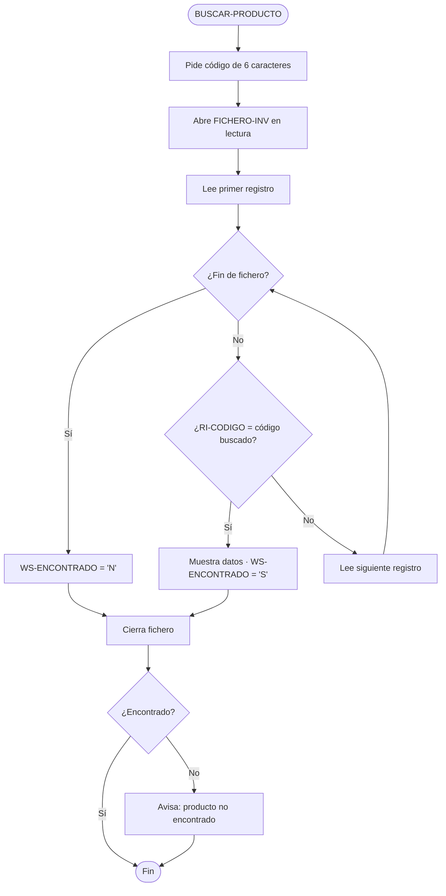

# Inventario de productos (COBOL) — documentación

> Documentación generada con Copilot en M7 (entender y documentar legacy) y revisada por un humano.
> Es un **borrador del 80% pulido**, no una verdad revelada: las reglas de negocio se han confirmado
> contra el comportamiento real del programa.

## Qué hace

Gestiona el inventario de productos de la distribuidora en un fichero secuencial (`inventario.dat`).
Programa interactivo por menú con cuatro operaciones:

| Opción | Operación | Párrafo |
|---|---|---|
| `A` | Alta de un producto nuevo | `ALTA-PRODUCTO` |
| `L` | Listado de todos los productos | `LISTAR-PRODUCTOS` |
| `B` | Búsqueda por código exacto | `BUSCAR-PRODUCTO` |
| `S` | Salir | — |

Compilar y ejecutar:

```bash
cobc -x -o inventario inventario.cob
./inventario
```

## El registro de inventario

```
01  REGISTRO-INV.
    05  RI-CODIGO        PIC X(6)      → código del producto (6 caracteres)
    05  RI-DESCRIPCION   PIC X(30)     → descripción
    05  RI-STOCK         PIC 9(5)      → unidades en stock
    05  RI-PRECIO        PIC 9(5)V99   → precio unitario en EUR (2 decimales)
```

## Glosario de campos

| Campo | Tipo | Qué representa |
|---|---|---|
| `RI-CODIGO` | `X(6)` | Código de producto. **Las 2 primeras posiciones son la categoría** (ej: `HW`=hardware, `EL`=eléctrico, `PL`=plástico/PVC); las 4 restantes, un secuencial dentro de la categoría. |
| `RI-DESCRIPCION` | `X(30)` | Nombre del producto, texto libre. |
| `RI-STOCK` | `9(5)` | Unidades en stock (0–99999). |
| `RI-PRECIO` | `9(5)V99` | Precio unitario. El `V99` es **coma decimal implícita**: el valor `0005005` se interpreta como `50,05 €`. |
| `WS-EOF` | `X(1)` | Bandera de fin de fichero: `'N'` = quedan registros, `'S'` = fin. |
| `WS-ENCONTRADO` | `X(1)` | Bandera de búsqueda: `'S'` = encontrado, `'N'` = no existe. |

> **Regla de negocio no documentada en ningún otro sitio:** la categoría vive en las 2 primeras letras
> del código. No hay un campo «categoría» aparte — está embebido en el `RI-CODIGO`. Esto es el ejemplo
> de M8 de «el código viejo es la especificación»: una regla real que solo conoce quien lee el dato.

## Flujo de la búsqueda



## Notas para mantenimiento

- **Formato fijo, columnas:** el programa está en formato fijo COBOL. No alterar la posición de las
  cláusulas ni el ancho de los campos de `REGISTRO-INV` sin migrar el fichero `inventario.dat`.
- **Búsqueda secuencial:** recorre todo el fichero hasta encontrar el código o llegar al final. Para
  ficheros grandes sería un candidato a indexar — pero ver M8: «¿debería, y compensa el riesgo?».
- **Sin validación de duplicados:** el alta no comprueba si el código ya existe. Es una limitación
  conocida del programa actual, no un bug a corregir sin pedirlo.
