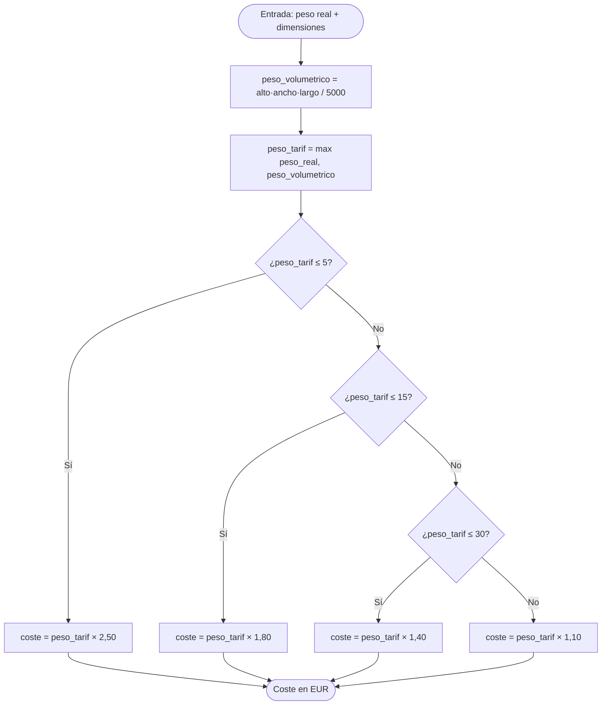

# Cálculo del coste de envío (FORTRAN) — documentación

> Documentación generada con Copilot en M7 y revisada por un humano. Para código numérico, lo valioso
> que aporta Copilot es entender **qué calcula** y **con qué supuestos** — sobre todo cuando una fórmula
> lleva años sin que nadie revise de dónde salió un factor.

## Qué hace

Calcula el coste de envío de un paquete según su **peso de tarificación**, que es el mayor entre el
peso real y el peso volumétrico. Es la regla estándar de logística: un paquete grande pero ligero
ocupa sitio en el camión, así que se cobra por volumen.

Compilar y ejecutar:

```bash
gfortran -o coste_envio envio_mod.f90 coste_envio.f90
./coste_envio
```

## La fórmula, paso a paso

**1. Peso volumétrico** (módulo `envio`, función `peso_volumetrico`):

```
peso_volumetrico = (alto_cm × ancho_cm × largo_cm) / 5000
```

El divisor `5000` (`DIVISOR_VOLUM`) es el **factor estándar de logística**: convierte cm³ en kg
equivalentes. Es el número que «lleva años ahí» — documentado aquí para que nadie tenga que volver a
adivinar de dónde sale.

**2. Peso de tarificación:**

```
peso_tarificacion = max(peso_real, peso_volumetrico)
```

**3. Coste por tramos** (función `coste_envio`):

| Tramo de peso de tarificación | Tarifa (`EUR/kg`) | Constante |
|---|---|---|
| 0 – 5 kg | 2,50 | `TARIFA_0_5` |
| 5 – 15 kg | 1,80 | `TARIFA_5_15` |
| 15 – 30 kg | 1,40 | `TARIFA_15_30` |
| > 30 kg | 1,10 | `TARIFA_MAS30` |

```
coste = peso_tarificacion × tarifa_del_tramo
```

> Los tramos usan `<=` en el límite superior: un paquete de **exactamente 5 kg** entra en el tramo
> 0–5 (no en el 5–15). Estos bordes exactos son justo los casos límite que M8 obliga a caracterizar
> antes de modernizar.

## Glosario de constantes (módulo `tarifas`)

| Constante | Valor | Qué representa |
|---|---|---|
| `DIVISOR_VOLUM` | `5000.0` | Factor cm³ → kg equivalente (estándar logística) |
| `TARIFA_0_5` | `2.50` | EUR/kg, tramo hasta 5 kg |
| `TARIFA_5_15` | `1.80` | EUR/kg, tramo 5–15 kg |
| `TARIFA_15_30` | `1.40` | EUR/kg, tramo 15–30 kg |
| `TARIFA_MAS30` | `1.10` | EUR/kg, tramo más de 30 kg |

## Flujo del cálculo



## Ejemplo trabajado

Paquete de **3 kg**, dimensiones **40 × 30 × 25 cm**:

1. Peso volumétrico = (40 × 30 × 25) / 5000 = 30 000 / 5000 = **6,0 kg**
2. Peso de tarificación = max(3,0 ; 6,0) = **6,0 kg** → tramo 5–15 kg
3. Coste = 6,0 × 1,80 = **10,80 €**

El paquete es ligero (3 kg) pero voluminoso, así que se cobra por volumen. Ese es el sentido de la
fórmula.

## Notas para mantenimiento

- **`implicit none` en todo** el módulo: ninguna variable implícita.
- **Las constantes viven en el módulo `tarifas`**, no incrustadas en la lógica. Si cambia una tarifa,
  se toca una sola línea. Si se añade un tramo, se añade la constante y un `else if` en `coste_envio`.
- **Código testeable:** las funciones están en el módulo `envio` (no dentro del `program`), por lo que
  se pueden caracterizar desde `test_coste_envio.f90` sin ejecutar el programa interactivo. Ver M8.
