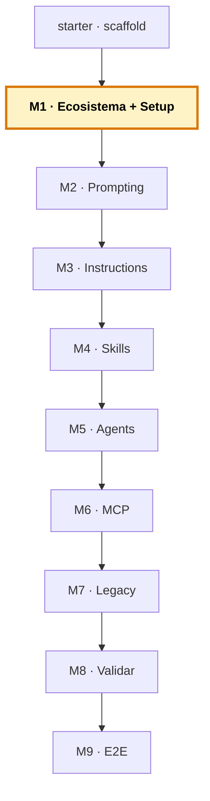

# Manual del alumno — M1 · Ecosistema y Setup

Esto **no** es el libro del módulo. El libro te explica qué es Copilot hoy (un sistema de agentes), las tres capas, los tres modos y el ángulo del curso. Este manual va por debajo: vas a **montar el entorno**, **abrir el proyecto de la distribuidora** y **probar los tres modos en los tres lenguajes** para ver con tus propios ojos que Copilot responde distinto según el lenguaje. Esa diferencia es el mapa de todo el curso.

Tiempo de lectura: ~20 min. Lab de referencia: sección 🧪 Lab M1 del libro. Punto de partida de la cadena de ramas.

> **Ramas del repo `distribuidora` para este módulo:**
> - **Partes de:** `starter` (scaffold vacío del proyecto)
> - **Llegas a:** `cap-01/setup` (el código legacy de los tres lenguajes: `pedidos.py`, `inventario.cob`, `coste_envio.f90`)
> - **Si te pierdes:** `git checkout cap-01/setup` te deja el estado correcto al final de M1.

*Creado: 2026-05-31*

---

## Dónde encaja este módulo en el curso



M1 abre el curso. Aquí todavía no construyes nada del sistema agéntico — eso empieza en M3. Lo que haces es **preparar el terreno**: montar VS Code con Copilot y los compiladores, abrir el proyecto legacy de la distribuidora, y comprobar de primera mano la idea que sostiene todo el curso: que Copilot rinde de forma muy distinta en Python que en COBOL o FORTRAN. Mapa completo de las ramas: [`../RAMAS-DEL-REPO.md`](../RAMAS-DEL-REPO.md).

---

## 1. La idea en una frase

Montas el entorno (VS Code + Copilot + Python + GnuCOBOL + gfortran), abres el repo de la distribuidora en la rama `cap-01/setup`, y lanzas la misma clase de petición en los tres lenguajes para **comprobar con tus manos** que Copilot escribe Python con soltura pero necesita que le des mucho más en COBOL y FORTRAN. Esa asimetría no es un defecto: es el hilo conductor que vas a explotar durante doce horas.

---

## 2. El problema real que hay detrás

Hay una idea muy extendida sobre Copilot que conviene desmontar antes de tocar nada: que sacarle partido va de aprender a escribir prompts mágicos. Como si existiera una fórmula de palabras que, bien escrita, hiciera que el modelo acertara siempre.

No va por ahí. La diferencia entre que Copilot te resuelva la vida o te haga perder el tiempo casi nunca está en cómo redactas el prompt. Está en **lo que el modelo sabe en ese momento**: qué tiene delante, qué le has contado de tu proyecto, y —esto es lo que descubres en M1— **cuánto sabe del lenguaje en el que trabajas**.

Y aquí está el punto de partida del curso: Copilot no sabe lo mismo de todos los lenguajes. Ha visto millones de líneas de Python en su entrenamiento, así que escribe Python idiomático casi sin ayuda. Pero ha visto muchísimo menos COBOL y FORTRAN, y todavía menos *tu* variante de COBOL con tu formato de columnas y tus campos heredados. En esos lenguajes, pedirle que escriba código nuevo es arriesgado; pedirle que lea y te explique es oro.

Este módulo no te enseña a explotar eso todavía — eso son los ocho capítulos siguientes. Lo que hace M1 es que lo **veas y lo sientas** con un experimento de cinco minutos, para que el resto del curso tenga sentido.

---

## 3. Por qué esto importa en tu stack

Si mantienes sistemas legacy —COBOL de mainframe, FORTRAN de cálculo, mezclados con Python moderno para datos— este curso está hecho para ti, y la razón es justo la asimetría de M1. La mayoría de cursos de Copilot te enseñan con un proyecto de JavaScript o Python donde el modelo acierta el 90% de las veces, y sales con la falsa impresión de que Copilot «lo hace solo». Luego abres tu COBOL de verdad y te estrellas.

Aquí pasa al revés. El caso guía —una distribuidora con tres piezas en tres lenguajes— está diseñado para que el legacy sea el protagonista. El FORTRAN del coste de envío, el COBOL del inventario: ahí es donde Copilot te obliga a hacer las cosas bien (dar contexto explícito, trocear, validar con datos conocidos). Y la gracia es que **esos buenos hábitos, aprendidos en el lenguaje difícil, luego también los aplicas en Python**. El legacy es el campo de entrenamiento.

---

## 4. Cómo funciona por dentro

Copilot tiene tres modos de interacción, y cada uno ve un contexto distinto. Entenderlo desde M1 te ahorra frustración:

- **Autocompletado inline** — las sugerencias en gris mientras escribes. Lee el código de alrededor del cursor y propone. No le pides nada explícito. Es para lo repetitivo.
- **Chat** — conversas: preguntas, pegas fragmentos, pides explicaciones. El contexto es lo que le aportas más los ficheros abiertos. Es el modo rey para entender legacy.
- **Agent mode** — le encargas una tarea entera y actúa: toca ficheros, lanza comandos, itera. El contexto es el espacio de trabajo más las herramientas que le des. Es el más potente y el que más vigilancia exige.

El curso entero vive sobre todo en **chat y agent mode**, porque son los modos donde tus convenciones (las que montas a partir de M3) se respetan. El autocompletado inline no usa las custom instructions — se guía solo por el código de alrededor.

Una cosa que conviene tener clara desde ya: Copilot no «aprende» de tu repo y guarda lo aprendido. Cada vez que le hablas, se le construye un contexto con lo que tienes abierto, lo que le aportas y (a partir de M3) tus instrucciones. Es declarativo y refrescable, no acumulativo.

---

## 5. Recorrido guiado: monta el entorno y siente la asimetría

Esta es la parte donde tocas. Sigue los pasos en orden.

### 5.1. Ponte en el estado de M1

```bash
git checkout cap-01/setup
```

Abre VS Code desde la raíz del repo (`code .`). Deberías ver tres carpetas con código: `python/`, `cobol/`, `fortran/`. Todavía no hay nada de `.github/` — eso llega en M3.

### 5.2. Verifica que las tres cadenas de herramientas funcionan

En la terminal de VS Code:

```bash
python --version      # Python 3.x
cobc --version        # GnuCOBOL
gfortran --version    # gfortran
```

Si los tres responden, tienes el entorno. Si COBOL o FORTRAN fallan, falta el compilador en el PATH (en Windows se instalan vía MSYS2 UCRT64). La licencia de Copilot **no** se verifica por terminal — se comprueba abriendo el chat.

### 5.3. Comprueba que Copilot está activo

Abre el Copilot Chat (icono de la barra lateral o el atajo de tu plataforma). Escribe «hola». Si responde, la licencia está activa y la extensión conectada. Asegúrate de que el selector del Chat puede ponerse en modo `Agent` (lo usarás a partir de M3).

### 5.4. El experimento: autocompletado en Python

Abre `python/pedidos.py`. Al final del fichero, escribe la firma de una función nueva y espera la sugerencia en gris:

```python
def total_por_producto(pedidos: list[dict]) -> dict:
    # espera la sugerencia en gris...
```

Copilot te va a completar el cuerpo con algo idiomático y casi seguro correcto: un `defaultdict`, un bucle, la agregación. Acepta con `Tab` o rechaza con `Esc`. **Fíjate en cuántas líneas acierta seguidas.** En Python suele ser impresionante. No guardes el cambio (era solo para sentir el modo); deshazlo con `Ctrl+Z`.

### 5.5. El experimento: chat sobre COBOL

Abre `cobol/inventario.cob`. Selecciona el párrafo `BUSCAR-PRODUCTO` entero. En el chat, con la selección activa, escribe:

```
Explícame qué hace este párrafo. ¿Por qué el código de producto tiene 6
caracteres? ¿Qué representan las dos primeras letras?
```

Copilot te va a explicar el flujo de la búsqueda y —si reconoce el patrón— te va a decir que las dos primeras letras son la categoría. **No ha tocado nada**: solo te ha ahorrado leer el COBOL a mano. Este es el modo rey en legacy: entender con riesgo casi cero.

### 5.6. El experimento: chat sobre FORTRAN

Abre `fortran/coste_envio.f90` y `fortran/envio_mod.f90`. En el chat:

```
Explícame la fórmula del coste de envío. ¿De dónde sale el divisor 5000?
¿Qué supuesto hay detrás de coger el mayor entre peso real y volumétrico?
```

Copilot te explica que el 5000 es el factor estándar de conversión cm³ → kg, y que se cobra por el mayor de los dos pesos porque un paquete grande pero ligero ocupa sitio en el camión. **Fíjate en que aquí Copilot brilla explicando, aunque escribir FORTRAN nuevo se le daría peor.**

### 5.7. Compara las tres experiencias

Piensa un momento en lo que acabas de ver:

- En **Python**, Copilot escribió código casi sin ayuda.
- En **COBOL** y **FORTRAN**, no le pediste que escribiera — le pediste que explicara, y ahí fue muy útil.

Esa diferencia de papel —escritor en Python, explicador en legacy— es exactamente el hilo conductor del curso. La sentirás en cada módulo.

---

## 6. La idea pedagógica clave: el mapa de confianza

La lección de M1 no es «cómo se instala Copilot». Es algo más fino: **Copilot rinde distinto según lo que sabe, y tu trabajo es leer ese mapa**.

Con Python, vuela — tú vigilas. Con COBOL y FORTRAN, sabe menos — le das el contexto que le falta, lo usas para entender antes que para escribir, y validas con red lo que transforma. Todo el curso es aprender a leer ese mapa y actuar en consecuencia. Si pillas esto en M1, los ocho módulos siguientes son la maquinaria para explotarlo.

---

## 7. El caso guía: la distribuidora

El repo tiene tres piezas, una por lenguaje, que vas a ver crecer módulo a módulo:

- **`python/pedidos.py`** — el parte de pedidos del día: lee un CSV y saca estadísticas por categoría. Es el lenguaje donde Copilot va sobrado.
- **`cobol/inventario.cob`** — el inventario: alta, listado y búsqueda por código de 6 caracteres (las 2 primeras letras = categoría). Legacy clásico con formato fijo.
- **`fortran/coste_envio.f90`** + `envio_mod.f90` — el cálculo del coste de envío por peso y volumen, con tarifas por tramos. Código numérico con un factor que «lleva años ahí».

Es ficticio y genérico a propósito: sin sector concreto, sin nombres reales. Lo que importa es que los tres lenguajes conviven en un proyecto, como en tantos sistemas industriales reales.

---

## 8. Errores comunes al empezar

- **Abrir VS Code desde una subcarpeta** en vez de desde la raíz del repo. Copilot busca el contexto (y, a partir de M3, las instrucciones) desde la raíz del workspace. Abre siempre con `code .` desde la raíz.
- **Confundir los modos.** Si pides algo en el autocompletado inline esperando que respete una convención, no va a pasar: las instrucciones solo aplican a chat y agent mode. En este curso, trabaja en chat/agent.
- **Frustrarse porque el COBOL le sale regular.** No es un fallo tuyo ni del curso — es el punto de partida. Copilot sabe menos COBOL, y los siguientes módulos son justo para compensarlo.
- **Saltarse la comprobación de compiladores.** Si gfortran o GnuCOBOL no están, los labs de M8 (tests) no podrán ejecutar. Mejor verificarlo ahora.

---

## 9. Verificación: ¿está bien cerrado el módulo?

Antes de pasar a M2, comprueba estos puntos:

1. **`python --version`, `cobc --version` y `gfortran --version`** responden los tres.
2. **El Copilot Chat responde** a un «hola» (licencia activa).
3. **Has visto el autocompletado en Python** completar una función.
4. **Has pedido en el chat una explicación de COBOL y otra de FORTRAN**, y has notado que el modo explicación funciona bien aunque sea legacy.
5. **Tienes claro** que Copilot rinde distinto por lenguaje — eso es el mapa del curso.

Si los cinco están, has cerrado M1.

---

## 10. Qué te llevas a M2

- **Un entorno montado** con los tres lenguajes y Copilot activo.
- **La intuición del mapa de confianza:** escritor en Python, explicador en legacy.
- **La idea de que el prompt importa menos que el contexto** — que es justo lo que desarrolla M2 a fondo: cómo dar contexto, cómo trocear, cómo validar. A mano, antes de automatizarlo con instructions (M3) y skills (M4).

---

> **Nota.** Este manual cubre lo que haces en M1. Para el contenido base completo del módulo (las tres capas, los tres modos en detalle, el ángulo diferencial del legacy), abre el libro firmado en [`../../temario/DEVCOP-M1-ecosistema-setup.md`](../../temario/DEVCOP-M1-ecosistema-setup.md).
