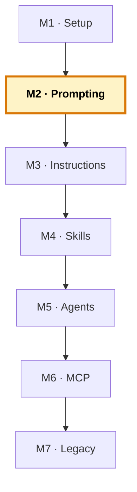

# Manual del alumno — M2 · Prompting y contexto

Esto **no** es el libro del módulo. El libro te explica por qué el contexto importa más que el prompt, los cuatro niveles de dar contexto y la disciplina de validar. Este manual va por debajo: vas a hacer **tres experimentos a mano** —el contraste del contexto, trocear un cambio, y validar con datos conocidos— en los tres lenguajes, para instalar en los dedos la habilidad que luego automatizarás con instructions y skills.

Tiempo de lectura: ~20 min. Lab de referencia: sección 🧪 Lab M2 del libro. Es un módulo de **método**: no añade nada al `.github/`, pero tiene su rama (checkpoint).

> **Ramas del repo `distribuidora` para este módulo:**
> - **Partes de:** `cap-01/setup` (el código legacy de los tres lenguajes)
> - **Llegas a:** `cap-02/prompting` (igual que `cap-01` + `LAB-M2-prompting.md` con tus notas)
> - **Si te pierdes:** `git checkout cap-02/prompting` te deja el estado correcto.

*Creado: 2026-05-31*

---

## Dónde encaja este módulo en el curso



M2 es el último módulo «a mano» antes de empezar a construir el sistema. Aquí aprendes a dar contexto, trocear y validar **escribiéndolo tú en cada prompt**. A partir de M3 eso se automatiza: las instructions dan el contexto estable, los skills el conocimiento profundo. Pero la intuición se coge aquí, repitiéndolo a mano. Mapa completo: [`../RAMAS-DEL-REPO.md`](../RAMAS-DEL-REPO.md).

---

## 1. La idea en una frase

Repites tres veces el mismo tipo de petición —una con poco contexto y otra con mucho— sobre el Python, el COBOL y el FORTRAN del proyecto, y compruebas que **la diferencia en la respuesta no la marca lo bonito del prompt, sino el contexto que le diste**: los ficheros abiertos, el fragmento señalado, la regla de negocio que solo tú conoces. Y que esa diferencia es mayor cuanto menos sabe Copilot del lenguaje.

---

## 2. El problema real que hay detrás

En M1 viste que Copilot rinde distinto por lenguaje. En M2 descubres la palanca que tienes para mover ese rendimiento: el **contexto**.

La mayoría de la gente, cuando Copilot no le da lo que quiere, hace lo intuitivo: reescribe el prompt, lo hace más largo, le pone «actúa como un ingeniero senior experto en…». Y casi nunca funciona, porque el problema no era el prompt. El problema era que el modelo no tenía delante lo que necesitaba para responder bien.

Piénsalo como cuando entra alguien nuevo al equipo. Da igual lo bien que le expliques la tarea: si no conoce vuestro código, vuestras convenciones ni por qué las cosas son como son, su primer intento va a ser genérico. No porque sea malo, sino porque le falta contexto. Con Copilot pasa exactamente igual — y la solución también: darle el contexto que le falta.

Este módulo te enseña a hacerlo a mano, con cuatro niveles de contexto y un patrón sencillo. Y a cerrar el círculo con la disciplina que no se negocia: validar lo que vuelve.

---

## 3. Por qué esto importa en tu stack

Con Python, dar contexto es opcional la mayoría de las veces — el modelo ya sabe. Con COBOL y FORTRAN, **es la diferencia entre código usable y código para tirar**.

Cuando le pides a Copilot que toque tu inventario COBOL sin contexto, te devuelve un COBOL genérico: su formato, su estilo, ajeno a tu fichero heredado. Cuando le das el contexto —el formato de columnas, que el código de producto ocupa posiciones concretas, qué significan los campos— te devuelve algo que encaja. La habilidad de dar ese contexto, primero a mano (M2) y luego automatizada (M3-M4), es lo que hace que Copilot sirva de verdad en legacy.

---

## 4. Cómo funciona por dentro

Cuando lanzas un prompt, al modelo no le llega solo lo que tecleaste. Le llega una construcción con varias capas: lo que tienes abierto, lo que le aportas (el fragmento seleccionado, lo que pegas) y tu prompt. Dar contexto es controlar esas capas. Hay cuatro niveles, de menos a más esfuerzo:

1. **Abrir los ficheros adecuados.** Copilot mira lo que tienes abierto. El contexto más barato: abre las pestañas correctas antes de preguntar.
2. **Señalar el fragmento concreto.** Selecciona las líneas y di qué te preocupa. Le das el foco exacto.
3. **Contar lo que no está en el código.** El porqué, la regla de negocio, el formato heredado. Lo que vive en la cabeza del equipo, no en el código. Aquí se nota más la diferencia.
4. **Dar un ejemplo.** Una entrada con su salida esperada vale más que tres párrafos.

Y un aviso: más contexto no es siempre mejor. La ventana del modelo es finita; si la llenas de cosas irrelevantes, diluyes lo que importa. El arte es darle lo **relevante**, no todo.

---

## 5. Recorrido guiado: tres experimentos

### 5.1. Ponte en el estado de M2

```bash
git checkout cap-02/prompting
code .
```

### 5.2. Experimento 1 — El contraste del contexto (Python)

**Sin contexto.** Abre el chat (modo Ask o Agent), sin abrir ningún fichero del proyecto, y escribe:

```
Mejora el cálculo de estadísticas de pedidos para que sea más útil.
```

Apunta lo que te devuelve. Será genérico: no sabe qué estadísticas calculas, ni el formato del CSV, ni qué significa «útil» en tu negocio.

**Con contexto.** Ahora abre `python/pedidos.py` y `python/datos/pedidos_dia.csv`. Selecciona la función `calcular_estadisticas`. En el chat, con la selección activa:

```
Objetivo: añadir al informe el importe medio por unidad y categoría.
Contexto: el CSV tiene columnas categoria, cantidad, precio_unitario.
  Ya calculo total_ventas y ventas_por_categoria.
Restricciones: redondea a 2 decimales como el resto; no uses librerías
  externas, solo stdlib.
```

Compara las dos respuestas. La segunda encaja con tu código; la primera era humo. **La única diferencia fue el contexto.**

### 5.3. Experimento 2 — Trocear un cambio (COBOL)

Abre `cobol/inventario.cob`. No pidas «añade búsqueda por categoría» de golpe. Trocéalo:

**Paso 1 — entender:**
```
Explícame cómo funciona el párrafo BUSCAR-PRODUCTO. Quiero añadir una
búsqueda por categoría (las 2 primeras letras del código) y necesito
entender primero la estructura.
```

**Paso 2 — el plan, sin tocar nada:**
```
Propón un plan para añadir una búsqueda por categoría que liste todos los
productos cuyas 2 primeras letras coincidan. No escribas código todavía,
solo el plan paso a paso.
```

**Paso 3 — el primer trozo:**
```
Implementa solo el primer paso del plan. Mantén el formato fijo y no
toques la estructura de REGISTRO-INV.
```

Revisa cada paso antes del siguiente. Con legacy, si no entiendes lo que cambias, estás rezando para que compile.

### 5.4. Experimento 3 — Validar con datos conocidos (FORTRAN)

Abre `fortran/coste_envio.f90` y `fortran/envio_mod.f90`. Pide un cambio pequeño:

```
Añade un mensaje de aviso si el peso de tarificación supera los 30 kg
(envío voluminoso). No cambies la fórmula del coste.
```

Ahora **valídalo con un caso que conoces**: un paquete de 3 kg y 40×30×25 cm debe dar un coste de **10,80 €** (peso volumétrico 6,0 kg, tramo 5-15, 6,0 × 1,80). Compila y ejecuta:

```bash
cd fortran
gfortran -o coste_envio envio_mod.f90 coste_envio.f90
./coste_envio
# introduce: 3   (peso)
#            40 30 25   (dimensiones)
```

¿Sale 10,80 €? Si el cambio de Copilot rompió la fórmula, lo cazas aquí. **Que compile no es que funcione.**

### 5.5. Guarda tus notas

El commit de `cap-02/prompting` añade un `LAB-M2-prompting.md` con las conclusiones de tus tres experimentos. Es opcional pero útil: te servirá de recordatorio de qué contexto funcionó mejor en cada lenguaje.

---

## 6. La idea pedagógica clave: la palanca está en el contexto, no en el prompt

Si Copilot genera algo que no quieres, la pregunta NO es «¿cómo le hago un mejor prompt?». Es **«¿qué contexto le falta?»**. ¿Tengo abiertos los ficheros correctos? ¿Le he contado la regla de negocio? ¿Le he dado un ejemplo?

Esta es la misma idea que sostiene los tres módulos siguientes. En M3 ese contexto se vuelve permanente (instructions). En M4 se empaqueta por dominio (skills). En M5 se reparte entre roles (agents). Pero el principio es el de M2: dale al modelo lo que le falta saber, y deja de pelear con las palabras del prompt.

---

## 7. La disciplina de validar

Lo que Copilot genera es una propuesta, no una verdad. Tres niveles, que vas a usar todo el curso:

- **Leerlo** — ¿hace lo que crees? ¿lo entiendes? Si no, no lo aceptes.
- **Probarlo** — pásale un caso conocido. En Python, que las pruebas pasen; en COBOL/FORTRAN, ejecuta con datos cuya respuesta sabes.
- **Desconfiar de lo que sabe peor** — con Python, revisión ágil; con COBOL y FORTRAN, sube la guardia. Es justo donde más fácil cuela un error con buena pinta.

Validar no es desconfiar por sistema; es hacer tu trabajo. El error más caro no es el que no compila — ese lo ves. Es el que compila, parece correcto, y hace algo sutilmente distinto.

---

## 8. Errores comunes

- **Reescribir el prompt en vez de dar contexto.** Si la respuesta es mala, abre los ficheros relevantes y señala el fragmento antes de tocar el prompt.
- **Pegarle el repositorio entero.** Más no es mejor: satura la ventana y diluye lo importante. Da lo relevante.
- **Pedir tareas enormes de un golpe.** «Reescribe el inventario para usar base de datos» sale mal. Trocea: entender → plan → un trozo → revisar.
- **Aceptar sin probar.** Sobre todo en COBOL y FORTRAN. Que compile no basta.

---

## 9. Verificación: ¿está bien cerrado el módulo?

1. Has hecho el **contraste del contexto en Python** y has visto dos respuestas claramente distintas.
2. Has **troceado un cambio en COBOL** (entender → plan → trozo) en vez de pedirlo de golpe.
3. Has **validado un cambio en FORTRAN** ejecutando con un caso cuyo resultado conocías (10,80 €).
4. Tienes claro que la palanca es el contexto, no el prompt.

Si los cuatro están, has cerrado M2.

---

## 10. Qué te llevas a M3

- **La habilidad de dar contexto a mano** — los cuatro niveles, el patrón objetivo·contexto·restricciones, el trocear, el validar.
- **El cansancio de repetirlo en cada prompt** — que es precisamente el problema que resuelve M3. En vez de contarle a Copilot tus convenciones una y otra vez, las escribes una vez en un fichero y se aplican solas. Eso es la capa 1 del sistema: las Custom Instructions.

---

> **Nota.** Para el contenido base completo (los cuatro niveles en detalle, el patrón, el «más contexto no es mejor», validar a fondo), abre el libro firmado en [`../../temario/DEVCOP-M2-prompting-contexto.md`](../../temario/DEVCOP-M2-prompting-contexto.md).
