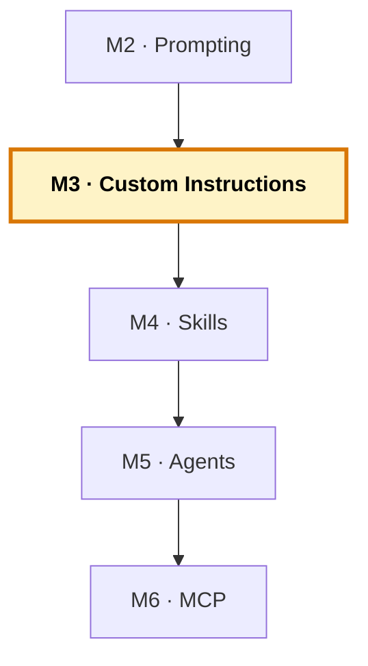

# Manual del alumno — M3 · Custom Instructions

Esto **no** es el libro del módulo. El libro te explica qué son las instructions, por qué un modelo sin contexto tira por lo más común, el peso de los «no» y los ficheros `applyTo`. Este manual va por debajo: vas a **crear los ficheros**, vas a **probar el mismo prompt antes y después** sobre el COBOL del inventario, y vas a ver con tus ojos cómo cambia el código que Copilot genera. Es la **capa 1** del sistema — la que más rinde por línea escrita.

Tiempo de lectura: ~25 min. Lab de referencia: sección 🧪 Lab M3 del libro.

> **Ramas del repo `distribuidora` para este módulo:**
> - **Partes de:** `cap-02/prompting` (código legacy + tus notas de prompting)
> - **Llegas a:** `cap-03/instructions` (+ `.github/copilot-instructions.md` y 3 ficheros `applyTo`)
> - **Si te pierdes:** `git checkout cap-03/instructions -- .github/` te trae los ficheros canónicos.

*Creado: 2026-05-31*

---

## Dónde encaja este módulo en el curso



M3 abre la **zona del sistema base de Copilot**: es el primer módulo donde tocas `.github/` para enseñarle algo a Copilot. Añades la **capa 1** — las Custom Instructions, las convenciones generales del proyecto en ficheros versionados. M4 añadirá la capa 2 (skills), M5 la capa 3 (agents), M6 la conexión externa (MCP). Mapa completo: [`../RAMAS-DEL-REPO.md`](../RAMAS-DEL-REPO.md).

---

## 1. La idea en una frase

Escribes un `copilot-instructions.md` con las convenciones del proyecto y tres ficheros `applyTo` (uno por lenguaje), los versionas con git, y a partir de ese momento Copilot genera COBOL con tu formato de columnas, FORTRAN con `implicit none`, y Python con type hints **sin que tengas que pedírselo en cada prompt**. La diferencia es brutal y se ve en cinco minutos — sobre todo en el COBOL, donde sin contexto el resultado es más ajeno.

---

## 2. El problema real que hay detrás

Si has pasado por M2, ya sabes dar contexto a mano. Funciona, pero tiene un defecto que cansa: cada conversación empieza de cero. Le explicas que en FORTRAN siempre `implicit none`, que en COBOL los campos van en mayúsculas con guiones, que el código de producto tiene 6 caracteres… y al rato, en otro chat, vuelta a empezar. Las mismas cinco frases, veinte veces al día.

Es como trabajar con alguien brillante que cada mañana no recuerda nada de tu proyecto. Las Custom Instructions son la cura: un fichero donde escribes una vez lo que Copilot debe saber siempre, y que se incorpora **automáticamente** a cada interacción de chat y de agent mode. No hay que activarlo ni mencionarlo. Está en el repo, versionado, y se aplica solo.

Y aquí entra el ángulo del curso: este efecto es mayor cuanto menos sabe Copilot del lenguaje. Con Python, el modelo ya acierta bastante sin instrucciones. Con COBOL y FORTRAN, donde «lo más común» que ha visto puede estar a años luz de tu variante, las instrucciones cambian el resultado de raíz.

---

## 3. Por qué esto importa en tu stack

Hay una decisión infravalorada que se toma al crear estos ficheros: el contexto del proyecto **se versiona en git**, junto al código. No vive en la configuración de tu VS Code, ni en un Confluence, ni en la cabeza del que lleva veinte años con el COBOL y se va a jubilar. Vive en `.github/`, viaja con el clone, y cuando un dev nuevo entra al equipo se trae el Copilot ya enseñado.

El día que cambies una convención —pongamos que decidís un formato de comentario nuevo para el COBOL heredado— abres un PR sobre el fichero de instrucciones, se revisa, se mergea, y a partir del siguiente `git pull` todo el equipo trabaja con la convención nueva. Sin reuniones de «recordad que ahora…». La fuente de verdad del estilo del equipo es un fichero, no la memoria de cada uno.

---

## 4. Cómo funciona por dentro

Cuando lanzas un prompt en chat o agent mode, lo que se le envía al modelo incluye, **siempre**, el contenido de `copilot-instructions.md` más (si el fichero que tocas coincide con un patrón `applyTo`) el bloque específico de ese lenguaje. En este orden:

```
[copilot-instructions.md]            ← se inyecta SIEMPRE
[el applyTo del lenguaje del fichero] ← si el path coincide
[contexto del workspace]
[tu prompt]
```

Dos consecuencias prácticas:

- **«Siempre activas» es literal.** No es un eufemismo. Por eso hay un coste: cada línea ocupa tokens. Treinta líneas bien escritas mueven el comportamiento; trescientas mal escritas lo diluyen. Cortas y concretas.
- **No es memoria persistente.** El modelo no «aprende» tu repo. Cada vez se le re-envía el fichero como contexto de *esa* sesión. Si lo borras, en la siguiente interacción Copilot vuelve a comportarse como recién instalado.

Un detalle de compatibilidad: el fichero general `copilot-instructions.md` funciona en VS Code, Visual Studio, github.com y JetBrains. Los ficheros `*.instructions.md` con `applyTo` funcionan en **VS Code y Visual Studio, no en JetBrains**. El IDE del curso es VS Code, así que aquí no hay problema.

---

## 5. Tour de los ficheros

La rama `cap-03/instructions` añade cuatro ficheros respecto a M2:

```
.github/
├── copilot-instructions.md           ← convenciones generales (todo el repo)
└── instructions/
    ├── python.instructions.md         ← applyTo: "**/*.py"
    ├── cobol.instructions.md          ← applyTo: "**/*.cob"
    └── fortran.instructions.md        ← applyTo: "**/*.f90"
```

El **general** lleva lo común: qué es la distribuidora, el dominio (qué es un pedido, un producto, el coste de envío), las reglas que valen para todo. Los **applyTo** llevan lo específico de cada lenguaje, y solo se cargan cuando tocas un fichero de ese tipo. Mira el del COBOL como ejemplo:

```yaml
---
applyTo: "**/*.cob"
---
- GnuCOBOL, formato fijo. Sentencias en columna 12+ (Area B).
- Nombres de campo en MAYÚSCULAS con guiones (ej: WS-COD-PRODUCTO).
- Código de producto: 6 caracteres; posiciones 1-2 = categoría.
- No usar GO TO en código nuevo.
- No cambiar el tamaño ni el orden de los campos de REGISTRO-INV.
- Variables de trabajo con prefijo WS-. Fin de fichero con WS-EOF ('N'/'S').
```

Fíjate en el peso de los «no»: «no usar GO TO», «no cambiar la estructura». En COBOL legacy, los «no» rinden el doble — le cierran al modelo las salidas por defecto que no encajan con tu fichero heredado.

---

## 6. Recorrido guiado: el antes/después en COBOL

### 6.1. Ponte en el estado de M2 (sin instrucciones todavía)

```bash
git checkout cap-02/prompting
code .
```

Comprueba que en `.github/` **no** hay `copilot-instructions.md`.

### 6.2. El «antes»: el prompt sin instrucciones

Abre el chat en modo `Agent`. Abre `cobol/inventario.cob`. Escribe **exactamente**:

```
Añade un campo para la categoría del producto al registro de inventario.
Lee el código existente y hazlo en el estilo que encaje. No ejecutes nada,
solo muéstrame el código.
```

Con alta probabilidad, Copilot te devuelve COBOL genérico: quizá en formato libre, quizá con nombres en minúscula, quizá tocando la estructura de `REGISTRO-INV` a su manera. **Correcto en abstracto, ajeno a tu fichero.** Cópialo a un scratch para compararlo luego.

> **Nota.** El resultado exacto varía según el modelo y el día. Lo que importa es el patrón: si te sale algo que no respeta el formato fijo o los nombres en mayúsculas, has reproducido el problema.

### 6.3. Crea los ficheros de instrucciones

**Forma directa (recomendada).** Crea los cuatro ficheros con el contenido de la rama de referencia. Puedes copiarlos de `cap-03/instructions` o escribirlos a mano siguiendo el tour de la sección 5.

**Forma agéntica (alternativa, para curiosidad).** En el chat en modo `Agent`:

```
Crea .github/copilot-instructions.md con el contexto del proyecto (una
distribuidora con inventario COBOL, coste de envío FORTRAN y pedidos
Python) y las reglas comunes. Luego crea .github/instructions/cobol.instructions.md
con applyTo "**/*.cob" que recoja: formato fijo, campos en mayúsculas con
guiones, código de producto de 6 caracteres (2 primeras = categoría), no
GO TO, no tocar la estructura de REGISTRO-INV.
```

Revisa la propuesta, corrige lo que no encaje, y guárdala. El contenido canónico del curso es el de `cap-03/instructions`.

### 6.4. El «después»: el mismo prompt, con instrucciones

Cierra el chat y ábrelo de nuevo (sesión limpia). Asegúrate de estar en modo `Agent` y con `cobol/inventario.cob` abierto. Escribe el **mismo prompt palabra por palabra** que en 6.2.

Esta vez deberías recibir COBOL que respeta el formato fijo, los nombres en mayúsculas con guiones, y que no toca la estructura del registro. **Mismo prompt, dos mundos. La diferencia es un par de ficheros Markdown en `.github/`.**

### 6.5. La prueba de fuego: bórralos y repite

Borra `.github/copilot-instructions.md` y los `applyTo`. Cierra el chat, abre uno nuevo, mismo prompt. Vuelve el COBOL genérico. No es magia — es exactamente lo esperado. Restaura los ficheros (`git restore .github/` si estás en la rama del curso) y sigue.

### 6.6. Compara con Python

Repite el experimento en `python/pedidos.py` («añade un campo nuevo a las estadísticas»). Verás que el salto antes/después es **menor** que en COBOL — porque el modelo ya acertaba bastante en Python sin instrucciones. Esa diferencia de magnitud es, otra vez, el mapa del curso.

---

## 7. La regla de decisión: instructions, skill o agent

En cada módulo hay un momento en que dudas dónde poner una cosa. La regla rápida:

| Pregunta | Capa | Módulo |
| --- | --- | --- |
| ¿Aplica a **todas** las interacciones? | Custom Instructions | M3 (este) |
| ¿Es un **procedimiento** detallado para una tarea concreta? | Agent Skill | M4 |
| ¿Necesita un **rol con herramientas restringidas**? | Custom Agent | M5 |
| ¿Tiene que **conectarse con un servicio externo**? | MCP | M6 |

El error común es meterlo todo en instructions. Si te encuentras escribiendo «para dar de alta un producto: primero abre el fichero, luego mueve el código a RI-CODIGO, luego…» — **stop**. Eso es un procedimiento. Va en un skill (M4). Las instructions son las **reglas generales**: el formato, las versiones, los «no» que cierran el camino por defecto.

---

## 8. Errores comunes al escribir tus instrucciones

- **El fichero kilométrico.** Pasa de 60 líneas y el modelo diluye. Si crece, parte: lo general en `copilot-instructions.md`, lo específico de cada lenguaje en su `applyTo`.
- **Reglas vagas.** «Escribe código limpio» no le dice nada. «Nombres de campo en mayúsculas con guiones» sí: es verificable en el output.
- **Olvidar los «no».** El sesgo del modelo hacia lo común es difícil de mover solo con reglas positivas. En legacy, los «no» son la palanca más eficaz.
- **Reglas que caducan.** No fijes una versión menor o un detalle que cambia cada sprint. Lo tendrás desactualizado.

Una práctica que ayuda: trata el fichero como **código vivo**. Cuando Copilot reincide en algo que no quieres, no lo corrijas a mano una y otra vez — añade la regla al fichero. Como vive en el repo, pasa por PR y lo revisa el equipo.

---

## 9. Verificación: ¿está bien cerrado el módulo?

1. **Los cuatro ficheros existen** en `.github/` y reflejan las convenciones del proyecto.
2. **El mismo prompt en dos sesiones nuevas** (con ficheros y sin ellos) **da resultados claramente distintos** en COBOL. Si no notas diferencia: revisa que los ficheros estén en `.github/`, que VS Code esté abierto desde la raíz, y que estés en agent mode.
3. **El COBOL generado con instrucciones** respeta el formato fijo, los nombres en mayúsculas y no toca `REGISTRO-INV`.
4. **Los ficheros están commiteados** — la idea de «el contexto viaja con el código» requiere que viaje.
5. **El salto en Python es menor que en COBOL** — has comprobado el mapa del curso.

Si los cinco están, has cerrado M3.

---

## 10. Qué te llevas a M4

- **Cuatro ficheros de instrucciones** versionados, aplicándose solos.
- **La intuición de «declarar una vez vs repetir siempre»**, que es el patrón de toda la capa de personalización.
- **La regla de decisión** instructions/skill/agent.

Lo siguiente, en M4: la capa 2. Vas a crear tres skills (`shipping-cost`, `inventory-cobol`, `order-data`), cada uno con el conocimiento profundo de su pieza del legacy. La diferencia con las instructions: los skills **no entran en cada prompt** — entran solo cuando su descripción encaja con lo que pides. Eso es la carga progresiva, y es lo que te deja meter mucho más conocimiento sin saturar el contexto.

---

> **Nota.** Para el contenido base completo (el porqué del fichero único, la regla de decisión, los `applyTo` en detalle, el peso de los «no»), abre el libro firmado en [`../../temario/DEVCOP-M3-custom-instructions.md`](../../temario/DEVCOP-M3-custom-instructions.md).
