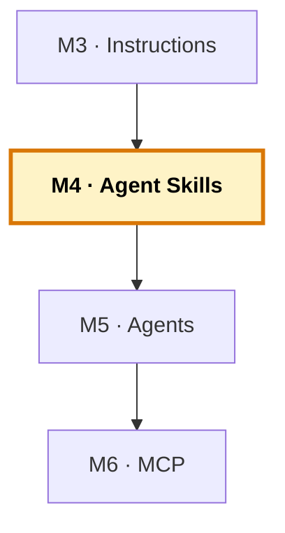

# Manual del alumno — M4 · Agent Skills

Esto **no** es el libro del módulo. El libro te explica qué es un skill, la carga progresiva, la `description` como gancho y el skill como cura del «el modelo no sabe mi COBOL». Este manual va por debajo: vas a **crear los tres skills del proyecto**, vas a **verlos activarse y desactivarse** según lo que pidas, y vas a comprobar que en COBOL/FORTRAN un skill le enseña a Copilot algo que no sabía. Es la **capa 2** del sistema.

Tiempo de lectura: ~25 min. Lab de referencia: sección 🧪 Lab M4 del libro.

> **Ramas del repo `distribuidora` para este módulo:**
> - **Partes de:** `cap-03/instructions` (instrucciones + applyTo)
> - **Llegas a:** `cap-04/skills` (+ 3 skills en `.github/skills/`)
> - **Si te pierdes:** `git checkout cap-04/skills -- .github/skills/` te trae los skills canónicos.

*Creado: 2026-05-31*

---

## Dónde encaja este módulo en el curso



M4 añade la **capa 2** del sistema: los skills. Donde las instructions (M3) eran convenciones generales siempre activas, los skills son conocimiento profundo que se carga solo cuando la tarea lo pide. M5 añadirá los roles (agents), M6 la conexión externa (MCP). Mapa completo: [`../RAMAS-DEL-REPO.md`](../RAMAS-DEL-REPO.md).

---

## 1. La idea en una frase

Creas tres ficheros `SKILL.md` —uno para el coste de envío FORTRAN, uno para el inventario COBOL, uno para los pedidos Python—, cada uno con el conocimiento profundo de su pieza, y compruebas que Copilot **carga solo el que encaja con lo que pides** y deja los otros dos sin tocar el contexto. En COBOL y FORTRAN, ese skill es el sitio donde le metes al modelo lo que no sabía de tu variante.

---

## 2. El problema real que hay detrás

En M3 montaste las instructions y viste su techo: funcionan porque son pocas y siempre aplicables. Pero ¿qué pasa con el conocimiento profundo y específico? La fórmula exacta del coste de envío con sus cuatro tramos y su factor volumétrico. El formato completo del registro de inventario con cada campo y su posición.

Si metes todo eso en `copilot-instructions.md`, el fichero crece sin control y, peor, le cargas a Copilot un montón de contexto irrelevante en cada petición — aunque la tarea no tenga nada que ver con el coste de envío. Es como darle la enciclopedia entera cuando solo preguntó la hora.

Los skills resuelven esto: **las instrucciones son el «siempre», los skills son el «cuando haga falta»**. Cada skill empaqueta el conocimiento de un dominio, y Copilot lo carga solo cuando tu petición encaja con su descripción.

---

## 3. Por qué esto importa en tu stack

Aquí está el ángulo del curso aplicado a la capa 2. Copilot conoce poco tu COBOL y tu FORTRAN. En M2 lo compensabas a mano; en M3 metiste las reglas básicas en las instrucciones. Pero el conocimiento profundo —el formato exacto de tu registro, la fórmula real con todos sus tramos— no cabe en las instrucciones sin saturarlas.

El skill es el sitio perfecto para eso. **Un skill es donde le enseñas a Copilot lo que no sabe de tu legacy**, empaquetado, para que lo cargue justo cuando toca esa tarea. Con Python te ahorra repetir patrones que ya casi sabe; con COBOL y FORTRAN le enseña lo que no sabía. Mismo mecanismo, mucho más valioso cuanto más viejo y raro es el lenguaje. Por eso este capítulo, en un curso de legacy, pesa más que en uno de Python a secas.

Y hay un efecto colateral grande: el conocimiento del legacy deja de ser tribal. En vez de vivir solo en la cabeza del que lleva veinte años, pasa a estar escrito en `.github/skills/`, versionado, y —a diferencia de un wiki que nadie lee— **se usa automáticamente** cada vez que alguien toca esa parte del código.

---

## 4. Cómo funciona por dentro

La pieza clave es la **carga progresiva** (progressive disclosure). Si Copilot cargara todos los skills a la vez, volveríamos al contexto saturado. En vez de eso, funciona en dos tiempos:

1. Copilot solo ve las **descripciones** de los skills disponibles — un texto corto por skill, del orden de 100 tokens cada uno.
2. Cuando tu petición encaja con una descripción, entonces —y solo entonces— carga el **cuerpo completo** de ese skill.

Es como un bibliotecario que conoce el índice de todos los libros pero no se los sabe de memoria: cuando le preguntas, va, coge el libro exacto y te lo trae. No te recita la biblioteca entera.

Por eso la `description` es la parte más importante del skill: es lo que Copilot lee para decidir si lo carga. Una vaga («ayuda con el código») no se activa nunca; una específica («trabaja con el registro de inventario en COBOL: formato fijo, posiciones de campo, código de producto, alta y búsqueda») se activa justo cuando toca.

Un detalle técnico que evita un error común: el `name` del frontmatter debe coincidir con el nombre de la carpeta del skill. Si no coinciden, el skill no se carga.

---

## 5. Tour de los skills

La rama `cap-04/skills` añade tres skills:

```
.github/skills/
├── shipping-cost/SKILL.md      ← FORTRAN: fórmula, tramos, factor volumétrico
├── inventory-cobol/SKILL.md    ← COBOL: registro, posiciones, alta y búsqueda
└── order-data/SKILL.md         ← Python: CSV, columnas, agregación
```

Mira la cabecera del de COBOL:

```yaml
---
name: inventory-cobol
description: Trabaja con el inventario de productos en COBOL GnuCOBOL
  formato fijo: alta de producto, listado completo, búsqueda por código
  de 6 caracteres donde los 2 primeros son la categoría. Actívate cuando
  el usuario pida modificar o corregir el programa de inventario COBOL.
---
```

La `description` es específica y llena de palabras del dominio («inventario», «formato fijo», «código de 6 caracteres», «categoría»). Esas palabras son el gancho: cuando tu petición las contiene, el skill se activa. El cuerpo, debajo, lleva el conocimiento concreto: el formato del registro campo a campo, las reglas, un ejemplo real.

Cada skill es un dominio acotado y no se solapan. Puedes mejorar el del COBOL sin tocar el del cálculo.

---

## 6. Recorrido guiado: ver la carga progresiva en acción

### 6.1. Ponte en el estado de M4

```bash
git checkout cap-04/skills
code .
```

Comprueba que existen los tres skills en `.github/skills/`.

### 6.2. Activa el skill del COBOL

Abre el chat en modo `Agent`. Pide algo del inventario:

```
Da de alta un producto de categoría hardware en el inventario COBOL.
```

Copilot debería **cargar el skill `inventory-cobol`** (porque tu petición encaja con su descripción) y generar código que respeta el formato del registro, las posiciones de campo, el código de 6 caracteres. Si tu cliente de Copilot muestra qué skills se han activado, verás `inventory-cobol` y **no** los otros dos. Esa es la carga progresiva: solo se cargó el que encajaba.

### 6.3. Activa otro skill distinto

En el mismo chat (o uno nuevo), pide algo de los pedidos:

```
Añade al informe de pedidos el total de unidades vendidas por categoría.
```

Ahora se activa `order-data`, no los de COBOL ni FORTRAN. Cada petición carga su skill. Decenas de skills podrían convivir en el repo sin penalización, porque solo se carga el que se usa.

### 6.4. Comprueba el efecto en el legacy

Para sentir el valor en COBOL, haz la comparación: borra temporalmente el skill `inventory-cobol` (o checkout de `cap-03`), pide el alta de producto, y compara con el resultado teniendo el skill. Con el skill, Copilot conoce el formato exacto que de otro modo no tendría. **Le enseñaste algo que no sabía.**

### 6.5. Crea un skill de cero (opcional)

Para practicar, crea un skill nuevo para una tarea concreta del FORTRAN. En el chat:

```
Crea un SKILL.md en .github/skills/shipping-tramos/ con name "shipping-tramos"
y una description específica sobre añadir o modificar tramos de tarifa en el
cálculo de coste de envío FORTRAN. El cuerpo debe explicar que las constantes
viven en el módulo tarifas y que añadir un tramo requiere una constante nueva
y un else if en coste_envio.
```

Revisa la propuesta, cuida que la `description` sea específica, y pruébalo con una petición que debería activarlo y otra que no.

---

## 7. La idea pedagógica clave: «siempre» vs «cuando haga falta»

La prueba práctica para decidir instruction o skill: ¿cuántas veces de cada diez peticiones lo necesitarías?

- **Nueve de diez** → instrucción (siempre activa).
- **Dos de diez** → skill (carga progresiva).

La fórmula exacta del coste de envío la usas dos de diez veces y ocupa media página: skill de libro. El formato de columnas que aplica a todo el COBOL: instrucción. Si lo tienes claro, M3 y M4 son variaciones del mismo patrón —dale al modelo lo que le falta— a distinta escala.

---

## 8. Errores comunes

- **`description` genérica.** «Ayuda con el COBOL» no se activa nunca. Específica, con verbos y sustantivos del dominio. Aquí se cae la mayoría de los intentos.
- **`name` que no coincide con la carpeta.** Si el `name` del frontmatter y el nombre de la carpeta difieren, el skill no carga. Tienen que ser idénticos.
- **Meter dos dominios en un skill.** El cálculo de envío y el inventario juntos hacen la descripción difusa y el skill se activa mal. Un skill, un dominio.
- **Cuerpo teórico.** El skill es para hacer: formato, posiciones, ejemplos concretos. No teoría.
- **Skill desactualizado.** Genera con patrones viejos, peor que no tenerlo. Mantenlos vivos.

---

## 9. Verificación: ¿está bien cerrado el módulo?

1. **Los tres skills existen** en `.github/skills/` con su `name` coincidiendo con la carpeta.
2. **Una petición del inventario activa `inventory-cobol`** y no los otros.
3. **Una petición de pedidos activa `order-data`** y no los otros.
4. **Has comprobado** que con el skill del COBOL el resultado respeta el formato que sin él no respetaría.
5. **Los skills están commiteados.**

Si los cinco están, has cerrado M4.

---

## 10. Qué te llevas a M5

- **Tres skills** con el conocimiento profundo del legacy, cargándose por demanda.
- **La intuición de la carga progresiva:** mucho conocimiento disponible sin saturar el contexto.
- **El conocimiento tribal convertido en activo del equipo**, versionado y de uso automático.

Lo siguiente, en M5: la capa 3. Hasta ahora Copilot ha sido un asistente con buen contexto (instructions) y buen conocimiento (skills), pero sigue siendo uno. En M5 pasa a ser un **equipo**: defines roles especializados (analista, desarrollador, verificador) con herramientas acotadas, y un orquestador que los coordina. Ahí es donde el sistema empieza a llevar tareas enteras, no solo a responder.

---

> **Nota.** Para el contenido base completo (la carga progresiva en detalle, la `description` como gancho, el skill como cura del legacy), abre el libro firmado en [`../../temario/DEVCOP-M4-agent-skills.md`](../../temario/DEVCOP-M4-agent-skills.md).
