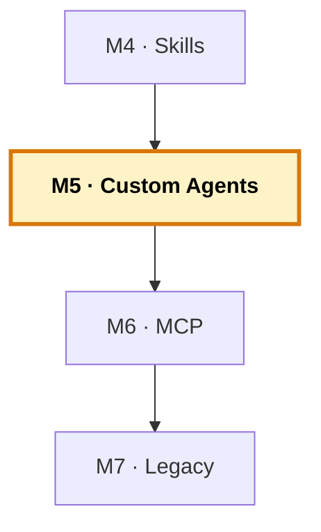

# Manual del alumno — M5 · Custom Agents, Handoffs y Plan Mode

Esto **no** es el libro del módulo. El libro te explica qué es un agente, por qué las herramientas son el límite, el patrón de handoffs que SÍ funciona y Plan Mode. Este manual va por debajo: vas a **crear el equipo de cuatro agentes**, vas a **verlo coordinar** una tarea de principio a fin, y vas a entender por qué el handoff intuitivo falla y el del orquestador funciona. Es la **capa 3** del sistema — la que convierte a Copilot de asistente en equipo.

Tiempo de lectura: ~30 min. Lab de referencia: sección 🧪 Lab M5 del libro.

> **Ramas del repo `distribuidora` para este módulo:**
> - **Partes de:** `cap-04/skills` (instrucciones + skills)
> - **Llegas a:** `cap-05/agents` (+ 16 agentes en `.github/agents/`: 4 genéricos por rol + 3 equipos por lenguaje con su orquestador)
> - **Si te pierdes:** `git checkout cap-05/agents -- .github/agents/` te trae los agentes canónicos.
> - **Referencia del patrón de handoffs:** `C:\w\AgentesCoordinados` (SOLO LECTURA) — el ejemplo que SÍ funciona en Copilot real.

*Creado: 2026-05-31*

---

## Dónde encaja este módulo en el curso



M5 añade la **capa 3**: los agentes. Con instructions (M3) y skills (M4) Copilot ya tenía buen contexto y buen conocimiento, pero seguía siendo un generalista. Aquí pasa a ser un **equipo de especialistas** con roles, herramientas acotadas y un orquestador que los coordina. Skills sin agents no se encadenan en flujos; aquí entra el control. M6 conectará el equipo con GitHub. Mapa completo: [`../RAMAS-DEL-REPO.md`](../RAMAS-DEL-REPO.md).

---

## 1. La idea en una frase

Creas cuatro ficheros `.agent.md` —un orquestador y tres especialistas (analista, desarrollador, verificador)—, cada uno con sus herramientas justas, y compruebas que el orquestador **coordina** a los demás para llevar una tarea de principio a fin: el analista planifica, el desarrollador implementa, el verificador comprueba, y el bucle gira hasta APROBADO. Y entiendes por qué el handoff «mágico» que casi todos los tutoriales enseñan **no funciona** en Copilot real, y el del orquestador sí.

---

## 2. El problema real que hay detrás

Hasta ahora Copilot ha sido un asistente para todo: le das contexto, le das conocimiento, y responde. Pero sigue siendo uno: un generalista que hace de todo en la misma conversación. Eso tiene dos límites.

El primero es de **calidad**: un agente que solo planifica piensa mejor el plan porque no se distrae implementando; un agente que solo revisa es más crítico porque su trabajo es encontrar problemas, no defender el código que escribió. La especialización sube la calidad.

El segundo es de **control**: un agente con herramientas acotadas no puede hacer estropicios fuera de su parcela. El que planifica no toca código; el que revisa no edita. Esa restricción, lejos de ser una limitación, es una garantía — y en un entorno donde el código mueve cosas de verdad, vale doble.

La capa 3 resuelve los dos: defines roles, cada uno con sus herramientas, y un orquestador que los coordina. El salto es de **un** asistente a **un equipo**.

---

## 3. Por qué esto importa en tu stack

En legacy, el verificador es la pieza de oro. Cuando la tarea es sobre COBOL o FORTRAN —donde el modelo sabe menos— el rol que ejecuta con datos conocidos y comprueba el resultado es el que caza el error sutil que el modelo cuela con buena pinta. El equipo no solo va más rápido: pone una red de seguridad justo donde más falta hace.

Y el equipo es **agnóstico del lenguaje**: el mismo flujo sirve para tocar el Python, el COBOL o el FORTRAN, porque los roles son sobre el *proceso* (planear, implementar, verificar), no sobre el idioma.

---

## 4. Cómo funciona por dentro

Un Custom Agent es un rol definido en `.github/agents/<nombre>.agent.md`: un Markdown con frontmatter YAML. Tiene cuatro cosas:

```yaml
---
name: analista
description: Estudia la tarea y propone un plan en docs/.
tools: ["read", "search", "edit"]
model: claude-sonnet   # opcional
---
# El cuerpo: cómo se comporta, qué prioriza, qué evita.
```

No es conocimiento (eso es un skill) — es un **rol con permisos**. Las `tools` son el límite: definen lo que puede y no puede hacer. El analista tiene `edit`, pero su cuerpo le prohíbe tocar el código de producción (solo escribe el plan en `docs/`). Esa distinción —tool disponible vs. conducta declarada— es la que lo hace fiable.

Y aquí está el punto que más se atasca en la práctica: **el handoff**.

---

## 5. El handoff: por qué el intuitivo falla

Lo natural es pensar: «defino tres agentes, y a cada uno le digo a quién pasarle el testigo. El analista pasa al desarrollador, el desarrollador al verificador, y el flujo corre solo».

**Suena lógico, pero no funciona.** En Copilot, un subagente no puede invocar a otro subagente. Cada uno trabaja aislado, con su propio contexto, hace su parte y devuelve un resultado — pero no puede llamar al siguiente. Si montas el equipo así, cada agente hace su trabajo y se para ahí. No hay cadena.

**El patrón que SÍ funciona es un orquestador.** Quien puede llamar a los demás es un agente especial que se ejecuta en el hilo principal y tiene la herramienta `agent`. Tú hablas solo con él. Él reparte: llama al analista, recoge el plan, llama al desarrollador con ese plan, recoge el código, llama al verificador, y según el veredicto vuelve a llamar al desarrollador o cierra. Los tres especialistas ni se enteran unos de otros.

Dos líneas del frontmatter del orquestador lo hacen posible:

```yaml
tools: ["agent", "read", "search", "execute"]
agents: ["analista", "desarrollador", "verificador"]
```

La herramienta `agent` permite invocar a otros; la propiedad `agents` declara a quién. Sin esas dos líneas, no hay coordinación. **El handoff no se autoorganiza: lo dirige el orquestador.**

> Este patrón está tomado del proyecto de referencia `C:\w\AgentesCoordinados` (solo lectura), donde el handoff funciona de verdad sobre un caso reproducible. Es el ejemplo correcto que sustituye a la «cadena mágica» rota de tantos tutoriales.

---

## 6. Tour del equipo

La rama `cap-05/agents` añade cuatro agentes:

```
.github/agents/
├── orquestador.agent.md     ← coordina, no programa · tools: agent,read,search,execute
├── analista.agent.md        ← estudia y escribe el plan · tools: read,search,edit (solo docs/)
├── desarrollador.agent.md   ← implementa y compila · tools: read,search,edit,execute
└── verificador.agent.md     ← ejecuta, comprueba, veredicto · tools: read,search,execute (no edita)
```

| Rol | Herramientas | Por qué esas |
| --- | --- | --- |
| Orquestador | agent, read, search, execute | Necesita `agent` para llamar a los demás; `execute` para git/gh |
| Analista | read, search, edit | Edita solo para escribir el plan en docs/, no producción |
| Desarrollador | read, search, edit, execute | Implementa y compila |
| Verificador | read, search, execute | Ejecuta y da veredicto, pero **no** arregla |

El verificador sin `edit` no puede «arreglar» algo y romper otra cosa. No es que se porte bien — es que no tiene la herramienta. Eso es mínimo privilegio aplicado a la IA.

### 6.1. Dos formas de organizar el equipo: por rol y por lenguaje

El equipo de cuatro de arriba es **genérico**: agnóstico del lenguaje, porque los roles son sobre el proceso (planear, implementar, verificar), no sobre el idioma. Es el patrón canónico y el que más se reutiliza.

Pero en un proyecto multilenguaje como este también es útil tener **un equipo especializado por lenguaje**, cada uno con su propio orquestador. La rama `cap-05/agents` incluye, además de los 4 genéricos, **tres equipos completos**:

```
.github/agents/
├── (genéricos)      orquestador · analista · desarrollador · verificador
├── (Python)         orquestador-python → analista-python · desarrollador-python · verificador-python
├── (COBOL)          orquestador-cobol  → analista-cobol  · desarrollador-cobol  · verificador-cobol
└── (FORTRAN)        orquestador-fortran→ analista-fortran· desarrollador-fortran· verificador-fortran
```

Cada `orquestador-<lenguaje>` declara su equipo en `agents: [...]` y aplica el mismo flujo (analista → desarrollador → verificador, con tope de 3 vueltas). La diferencia es el conocimiento incorporado: el equipo COBOL sabe del formato fijo y sube la guardia; el de Python va más rápido; el de FORTRAN valida con los bordes de tramo.

> **Detalle del verificador COBOL:** `cobol-check` puede no estar instalado en todas las máquinas. Por eso `verificador-cobol` lo trata como **opcional**: si está, ejecuta los `.cut`; si no, verifica compilando con `cobc` y ejecutando con datos conocidos — y **no falla** por la ausencia del runner. Capar esa dependencia evita que el agente se atasque por una herramienta que falta.

Cuándo usar cuál: el genérico para tareas que cruzan lenguajes o cuando quieres el patrón limpio; el de cada lenguaje cuando la tarea es claramente de uno solo y quieres su especialización.

---

## 7. Recorrido guiado: el equipo coordinando

### 7.1. Ponte en el estado de M5

```bash
git checkout cap-05/agents
code .
```

Comprueba que los cuatro agentes aparecen disponibles en el selector de agentes del Chat.

### 7.2. Da un objetivo sobre Python (el fácil)

Habla con el **orquestador**. Dale una mejora pequeña:

```
Añade al informe de pedidos el importe medio por categoría de producto,
con su prueba.
```

Observa el flujo: el orquestador llama al **analista**, que estudia el código y escribe un plan; luego al **desarrollador**, que implementa siguiendo el plan; luego al **verificador**, que ejecuta y comprueba. Si el verificador da REVISAR, el orquestador devuelve el trabajo al desarrollador. Cada rol en lo suyo. **Eso es el handoff funcionando.**

### 7.3. Repite sobre COBOL (el difícil)

Dale al orquestador una tarea del inventario:

```
Añade una búsqueda por categoría al inventario COBOL, con datos de prueba.
```

Fíjate en cómo el **verificador**, al ejecutar con datos conocidos, es la red que caza lo que el modelo no clava en COBOL. En el lenguaje difícil, el equipo no solo va más rápido — protege.

### 7.4. Mete Plan Mode

Antes de dejar que el desarrollador implemente, usa **Plan Mode**: pide al equipo que te presente el plan, léelo, y apruébalo (o corrígelo) antes de que toque nada. Cámbialo a propósito una vez para comprobar que el control es tuyo.

¿Por qué importa con legacy? Porque el coste de un error es asimétrico. En un script de Python de usar y tirar, que el agente se lance y rectifiques no pasa nada. En un COBOL de inventario del que dependen otros sistemas, quieres ver el plan **antes** de que toque nada. Plan Mode te da ese freno.

### 7.5. Provoca el error del handoff (opcional, muy instructivo)

Edita temporalmente `orquestador.agent.md` y quita `agent` de la lista de `tools` (o vacía `agents`). Vuelve a darle un objetivo. Verás que **no delega** — intenta hacerlo todo él mismo. Restaura las dos líneas y vuelve a funcionar. Así interiorizas que el handoff vive en esas dos líneas.

---

## 8. El bucle del verificador

El verificador no edita: ejecuta, comprueba contra el plan y emite un veredicto.

- **APROBADO** → el orquestador sigue: prepara el commit, abre el PR (eso, con MCP, en M6).
- **REVISAR** → el orquestador devuelve el trabajo al desarrollador con el feedback. El desarrollador corrige. Vuelta al verificador.

El **tope de intentos** es clave: sin él, un error que el desarrollador no sabe resolver haría girar el bucle sin fin. Con un máximo (normalmente 3), si no se resuelve, el equipo para y te avisa. Mejor un equipo que se rinde y consulta que uno que da vueltas en vacío.

---

## 9. Errores comunes

- **El orquestador no delega** → falta `agent` en `tools` o falta la propiedad `agents`. El fallo número uno.
- **Un subagente no se invoca** → el `name` del fichero no coincide con el de la lista `agents`. Tienen que ser idénticos.
- **Agentes con todas las herramientas «por si acaso»** → destruye el control, que es la razón de ser de los agentes. Herramientas mínimas, siempre.
- **Esperar que la cadena mágica funcione** → no funciona. El handoff lo dirige el orquestador, no se autoorganiza.

---

## 10. Verificación: ¿está bien cerrado el módulo?

1. **Los agentes existen** y aparecen en el Chat: los 4 genéricos por rol y los 3 equipos por lenguaje (cada uno con su orquestador).
2. **El orquestador delega**: al darle un objetivo, llama al analista, al desarrollador y al verificador en orden.
3. **El verificador no edita** — solo ejecuta y da veredicto.
4. **Has usado Plan Mode** para aprobar un plan antes de implementar.
5. **Entiendes** por qué el handoff vive en `tools: [agent]` + `agents: [...]`.

Si los cinco están, has cerrado M5.

---

## 11. Qué te llevas a M6

- **Un equipo de cuatro agentes** que coordina tareas de principio a fin.
- **El patrón de handoffs correcto** (orquestador), no la cadena mágica.
- **Plan Mode** como punto de control humano.

Lo siguiente, en M6: la conexión externa. El equipo ya trabaja dentro del editor, pero sigue encerrado ahí. Con el GitHub MCP, el orquestador podrá crear el issue, abrir el PR y enlazarlos — sin que tú salgas del editor. Y verás el `gh` CLI como red para cuando el MCP no autentique.

---

> **Nota.** Para el contenido base completo (las herramientas como límite, el patrón de handoffs en detalle, Plan Mode, los cuatro roles), abre el libro firmado en [`../../temario/DEVCOP-M5-custom-agents-handoffs-planmode.md`](../../temario/DEVCOP-M5-custom-agents-handoffs-planmode.md).
