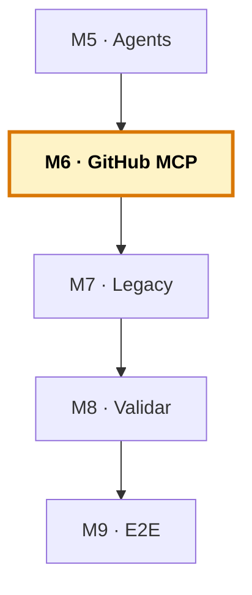

# Manual del alumno — M6 · GitHub MCP y ecosistema

Esto **no** es el libro del módulo. El libro te explica qué es MCP, el servidor de GitHub, el flujo issue→PR y el `gh` CLI como red. Este manual va por debajo: vas a **configurar el servidor MCP**, vas a **dejar el `gh` CLI listo como red de seguridad**, y vas a **ejecutar el flujo issue→PR** desde el chat sin abrir el navegador. Es la **conexión externa** del sistema.

Tiempo de lectura: ~25 min. Lab de referencia: sección 🧪 Lab M6 del libro.

> **Ramas del repo `distribuidora` para este módulo:**
> - **Partes de:** `cap-05/agents` (instrucciones + skills + agentes)
> - **Llegas a:** `cap-06/mcp` (+ `.vscode/mcp.json`)
> - **Si te pierdes:** `git checkout cap-06/mcp -- .vscode/mcp.json` te trae la configuración canónica.

*Creado: 2026-05-31*

---

## Dónde encaja este módulo en el curso



M6 cierra el **sistema base de Copilot**: la conexión externa. Con instructions (M3), skills (M4) y agents (M5), el equipo ya trabajaba dentro del editor. El MCP lo saca fuera: ahora el orquestador puede crear issues y abrir PRs en GitHub. Al terminar M6 tienes el sistema agéntico completo. La sesión 3 (M7–M9) lo usa para trabajar el legacy. Mapa completo: [`../RAMAS-DEL-REPO.md`](../RAMAS-DEL-REPO.md).

---

## 1. La idea en una frase

Configuras `.vscode/mcp.json` con el servidor MCP de GitHub, dejas `gh auth status` en verde como red de seguridad, y compruebas que desde el chat puedes crear un issue, trabajar la solución con el equipo de agentes y abrir un PR enlazado — **sin salir del editor ni una vez**.

---

## 2. El problema real que hay detrás

Hasta aquí, Copilot vive en tu editor. Lee tu código, genera, refactoriza — pero todo dentro de los límites del espacio de trabajo. Cuando necesitas algo de fuera —crear un issue, mirar un PR, consultar el estado de CI— sales del editor, vas a GitHub, haces la tarea a mano, y vuelves. Ese ir y venir rompe el flujo y come tiempo. Y en un flujo de desarrollo real, esa frontera se cruza decenas de veces al día.

MCP es la respuesta: un estándar abierto que le da a Copilot una forma de hablar con el mundo exterior. La idea: que el agente pueda crear el issue, abrir el PR o consultar el estado sin que tú salgas del editor.

---

## 3. Por qué esto importa en tu stack

El patrón que aprendes aquí sirve para **cualquier servidor MCP**, no solo GitHub. Es un protocolo estándar —en la misma idea que HTTP entre navegador y servidor: en vez de una integración a medida para cada herramienta, un único lenguaje común que todas hablan. Hoy conectas GitHub; mañana, con el mismo patrón, tu base de datos, tu rastreador de incidencias interno, tu CI.

Y hay un matiz industrial importante: en entornos corporativos la autenticación tiene sus reglas, y el MCP a veces no conecta a la primera. Por eso el curso enseña, junto al MCP, el `gh` CLI como red. Tener las dos vías es lo que hace que el flujo funcione siempre — delante de la clase, del jefe, o en producción.

---

## 4. Cómo funciona por dentro

Un servidor MCP expone tres tipos de cosas: **tools** (acciones que el modelo puede ejecutar, como «crea un issue»), **resources** (datos que puede leer) y **prompts** (plantillas). En la práctica, lo que más usarás son las tools.

La configuración vive en `.vscode/mcp.json` (para el espacio de trabajo):

```json
{
  "servers": {
    "github": {
      "type": "http",
      "url": "https://api.githubcopilot.com/mcp/"
    }
  }
}
```

**Autenticación:** tanto el servidor remoto como el local admiten OAuth y PAT. El remoto usa OAuth por defecto (flujo de un clic, recomendado); el local con Docker/binario también lo admite, aunque suele configurarse con PAT cuando el entorno corporativo no tiene flujo OAuth directo.

**Seguridad:** el servidor actúa en tu nombre, con tus permisos. Dale los mínimos necesarios — si solo crea issues y PRs, nada de administración del repo. Y nunca incrustes credenciales en el JSON versionado: van en variables de entorno o gestores de secretos.

---

## 5. Recorrido guiado: el flujo issue→PR

### 5.1. Ponte en el estado de M6

```bash
git checkout cap-06/mcp
code .
```

### 5.2. Configura el servidor MCP

El fichero `.vscode/mcp.json` ya está en la rama. Revísalo. Al abrir VS Code, Copilot detectará el servidor; la primera vez te pedirá autenticar (OAuth, un clic). Si tu entorno corporativo no permite OAuth directo, el manual del servidor de GitHub explica la vía con PAT.

### 5.3. Deja la red lista: `gh` CLI

En la terminal:

```bash
gh auth login      # si no lo has hecho antes
gh auth status     # debe salir en verde
```

Con esto, aunque el MCP falle, el flujo funciona: un agente bien montado intenta primero el MCP y, si no autentica, cae al `gh` CLI. Tú no notas la diferencia.

### 5.4. Verifica la conexión

En el chat:

```
Lista los issues abiertos del repositorio.
```

Si responde con la lista (o «no hay issues abiertos»), está conectado.

### 5.5. Crea un issue

```
Crea un issue para añadir validación de cantidad negativa en el alta de
producto del inventario.
```

Copilot crea el issue por MCP (o por `gh` si el MCP no está). Ya tienes el número de seguimiento.

### 5.6. Abre un PR enlazado

Haz un cambio pequeño en el código (o deja que el equipo de agentes lo haga), y pide:

```
Abre un PR con estos cambios, enlazado al issue que acabamos de crear.
```

Comprueba en GitHub que el issue y el PR existen y están enlazados. **Todo el recorrido ha ocurrido desde el chat, sin abrir el navegador.**

### 5.7. Prueba la red (opcional)

Para ver el diseño defensivo en acción, simula un fallo del MCP (por ejemplo, una URL mal puesta en `mcp.json`) y repite la creación de un issue. Si tienes `gh auth status` en verde, el flujo debería caer al `gh` CLI y salir igual. Restaura `mcp.json` después.

---

## 6. El ecosistema MCP: más allá de GitHub

GitHub es el ejemplo porque el flujo issue→PR es universal. Pero el mismo patrón conecta Copilot con bases de datos (consultar el esquema, generar queries con el contexto real de tus tablas), almacenamiento (leer documentación, logs), o herramientas internas de la empresa. No estás aprendiendo «la integración de GitHub» — estás aprendiendo la forma estándar de conectar Copilot con el mundo.

---

## 7. Seguridad en entorno corporativo e industrial

- **Mínimo privilegio** — el token o alcance OAuth solo con lo que necesita.
- **Nunca credenciales en el repositorio** — variables de entorno o gestores de secretos, jamás en el JSON versionado. Un token filtrado con permisos amplios es una brecha seria.
- **Revisa antes de aprobar lo irreversible** — MCP puede crear y borrar. Antes del visto bueno a algo que no se deshace, mira qué va a ejecutar.
- **Servidores de confianza** — oficiales o revisados. El de GitHub es oficial; los de terceros, verifícalos.

---

## 8. Errores comunes

- **Token con demasiados permisos «para que funcione seguro»** → es justo lo contrario: amplías el riesgo que querías evitar. Empieza con lo mínimo.
- **Esperar que el MCP autentique siempre** → en corporativo no es raro que falle. Sin el `gh` CLI como red, la demo se cae.
- **Incrustar el token en `mcp.json` y commitearlo** → el error de seguridad clásico. El fichero viaja con el repo; el secreto, no.
- **Confundir servidor remoto y local** → ambos admiten OAuth y PAT. Saber cuál usas evita pelearte con la autenticación.

---

## 9. Verificación: ¿está bien cerrado el módulo?

1. **`.vscode/mcp.json` existe** y el servidor de GitHub está configurado.
2. **`gh auth status` en verde** — la red lista.
3. **«Lista los issues abiertos»** responde — conexión verificada.
4. **Has creado un issue y abierto un PR enlazado** desde el chat, sin navegador.
5. **El token tiene permisos mínimos** y no está en el repo.

Si los cinco están, has cerrado M6 — y con él, el sistema base completo.

---

## 10. Qué te llevas a M7

- **El sistema agéntico completo**: instructions + skills + agents + MCP, montado sobre el proyecto legacy.
- **El flujo issue→PR** funcionando desde el editor, con `gh` como red.

Cambio de sesión. Hasta aquí (M1–M6) has **construido el sistema**. La sesión 3 (M7–M9) lo **usa para trabajar el legacy de verdad**: entender y documentar el COBOL/FORTRAN que nadie toca (M7), modernizarlo con una red de validación (M8), y cerrar con el flujo completo de issue a PR sobre el caso real (M9). El sistema ya está; ahora se trabaja con él.

---

> **Nota.** Para el contenido base completo (qué es MCP, el servidor de GitHub, el flujo issue→PR, el `gh` CLI como red, seguridad), abre el libro firmado en [`../../temario/DEVCOP-M6-github-mcp.md`](../../temario/DEVCOP-M6-github-mcp.md).
