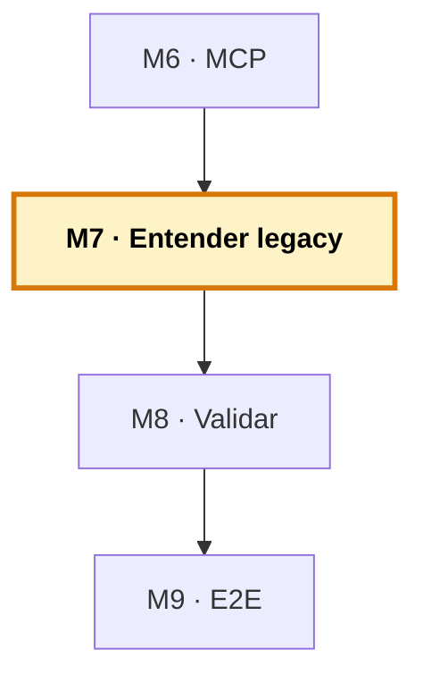

# Manual del alumno — M7 · Entender y documentar legacy

Esto **no** es el libro del módulo. El libro te explica por qué con legacy el papel rentable de Copilot es explicar (no escribir), las formas de preguntar, los entregables de documentación y los límites. Este manual va por debajo: vas a **coger el COBOL y el FORTRAN del proyecto** y, con el chat de Copilot, **entenderlos y documentarlos de verdad** — comentarios, README, diagramas Mermaid y glosarios. Es el primer módulo de la sesión 3: usar el sistema sobre el legacy.

Tiempo de lectura: ~25 min. Lab de referencia: sección 🧪 Lab M7 del libro.

> **Ramas del repo `distribuidora` para este módulo:**
> - **Partes de:** `cap-06/mcp` (sistema base completo)
> - **Llegas a:** `cap-07/docs` (+ `cobol/INVENTARIO.md` y `fortran/COSTE_ENVIO.md` con glosarios y diagramas)
> - **Si te pierdes:** `git checkout cap-07/docs -- cobol/INVENTARIO.md fortran/COSTE_ENVIO.md` te trae la documentación canónica.

*Creado: 2026-05-31*

---

## Dónde encaja este módulo en el curso



M7 abre la sesión 3. A diferencia de los módulos anteriores, aquí **no construyes una capa nueva del sistema** — usas el sistema (sobre todo el chat) para hacer el trabajo real de quien mantiene legacy: entender y documentar el código que nadie quiere tocar. M8 lo modernizará con red; M9 cerrará con el flujo completo. Mapa completo: [`../RAMAS-DEL-REPO.md`](../RAMAS-DEL-REPO.md).

---

## 1. La idea en una frase

Coges el inventario COBOL y el coste de envío FORTRAN —código heredado, denso, con campos crípticos y un factor que «lleva años ahí»— y, preguntándole a Copilot de la forma correcta, sacas su documentación: un README por módulo, diagramas de flujo Mermaid, glosarios de campos. Y aprendes dónde **no** fiarte de lo que el modelo te cuenta.

---

## 2. El problema real que hay detrás

Toda empresa con unos años encima tiene ese programa. El que lleva funcionando desde antes de que la mitad del equipo entrara, sin comentarios, con nombres de variable que eran claros para alguien que ya no está. Entenderlo ha sido siempre arqueología: leer, seguir el hilo de una variable por mil líneas, dibujar diagramas en una servilleta, preguntar al que lleve más tiempo, y rezar.

Aquí Copilot cambia de papel. Con un lenguaje viejo que el modelo conoce a medias, pedirle que *escriba* es arriesgado; pedirle que *lea y te explique* es oro. Porque para explicar no necesita dominar tu dialecto al detalle: necesita reconocer patrones, y eso lo hace bien hasta en COBOL.

Y hay una razón de fondo para empezar por aquí: el riesgo es **asimétrico**. Escribir código nuevo en un lenguaje que el modelo domina poco produce algo que compila pero puede estar sutilmente mal, y el error se queda en tu base de código. Leer y explicar es otra cosa: el modelo te da su interpretación, tú la contrastas con el comportamiento real, y si se equivoca lo cazas en el acto — no has cambiado nada. En explicar, lo peor que pasa es corregir una frase. En escribir mal, lo peor llega a producción.

---

## 3. Por qué esto importa en tu stack

Lo que produces aquí no se queda en tu pantalla. El README, el glosario, el diagrama — todo entra en el repositorio y se queda para el siguiente que tenga que tocar ese código. El conocimiento del legacy deja de ser tribal: en vez de vivir solo en la cabeza del que lleva veinte años (y se va a jubilar), pasa a estar escrito, versionado y a la vista de todos.

Y hay un efecto bola de nieve: cuanto mejor documentado está el programa, mejor lo entiende Copilot la próxima vez — porque ahora tiene comentarios y un README que leer. Documentar el legacy mejora al humano que viene detrás y a la propia herramienta.

---

## 4. Cómo funciona por dentro: las formas de preguntar

«Explícame esto» a secas se queda corto. Hay formas de preguntar que sacan mucho más:

- **De lo general a lo concreto.** Primero «¿qué hace este programa, en dos párrafos?»; luego, sobre lo que no entiendas, «¿qué hace este bloque?». No empieces por la línea 400; empieza por el mapa.
- **Pregunta por el porqué, no solo el qué.** «¿Por qué este campo tiene 6 caracteres?» El modelo razona sobre la intención y muchas veces acierta el motivo que el código no dice.
- **Traduce a pseudocódigo.** Para un COBOL denso, convierte algo ilegible en algo que entiendes en treinta segundos. Para entender, no para sustituir.
- **Que te diga qué NO tiene claro.** «¿Qué partes son ambiguas o podrían tener efectos no visibles?» Te señala dónde mirar con lupa.

---

## 5. Recorrido guiado: descifra el inventario COBOL

### 5.1. Ponte en el estado de M7

```bash
git checkout cap-06/mcp     # partimos de aquí; iremos generando la documentación
code .
```

### 5.2. El mapa primero

Abre `cobol/inventario.cob`. En el chat:

```
Explícame qué hace este programa de inventario en dos párrafos. No entres
en detalle todavía, solo el mapa general.
```

Lee la respuesta antes de bajar al detalle.

### 5.3. Pseudocódigo de lo denso

Elige el párrafo `BUSCAR-PRODUCTO`. Pide:

```
Reescribe la lógica de BUSCAR-PRODUCTO como pseudocódigo en español.
```

Comprueba que cuadra con lo que el código hace de verdad.

### 5.4. Genera la documentación

Pide los cuatro entregables:

```
Genera un README del módulo de inventario que incluya: qué hace, una tabla
con cada campo del registro (nombre, tipo PIC, qué representa), un glosario
que destaque que las 2 primeras letras del código son la categoría, y un
diagrama de flujo Mermaid de la búsqueda. No cambies ninguna línea del
programa.
```

Revisa lo que genera — es un **borrador del 80%**, no una verdad revelada. Corrige con lo que tú sabes del negocio. El resultado de referencia está en `cobol/INVENTARIO.md` de la rama `cap-07/docs`.

### 5.5. Repite con el FORTRAN

Abre `fortran/coste_envio.f90` y `fortran/envio_mod.f90`. Pide la documentación del cálculo: la fórmula paso a paso, de dónde sale el divisor 5000, la tabla de tramos, y un diagrama Mermaid. El resultado de referencia está en `fortran/COSTE_ENVIO.md`.

### 5.6. Caza el punto ciego

Esto es la lección de los límites, en directo. Busca a propósito un campo con nombre potencialmente engañoso (o invéntate uno: imagina que `RI-STOCK` en realidad guardara «stock reservado» y no «stock disponible»). Pregúntale a Copilot qué representa. Verás que te da una explicación **plausible** basada solo en el nombre — que puede no ser la real. Esa es la trampa: contrasta siempre con el comportamiento real, no con lo que el nombre sugiere.

---

## 6. Los límites: dónde NO fiarte

Tres puntos ciegos que hay que conocer:

- **Puede inventar una explicación plausible y errónea.** Si una variable se llama `TOTAL` pero guarda un subtotal, el modelo te dirá «esto es el total» con total seguridad. Suena bien; está mal. Contrasta con el comportamiento real.
- **No conoce tu negocio.** Sabe leer la sintaxis, no sabe por qué aplicáis ese recargo solo los martes. El «qué hace» lo acierta; el «por qué tiene sentido» lo pones tú.
- **Cuanto más raro el dialecto, más cautela.** Un COBOL con extensiones propietarias puede tener construcciones que el modelo malinterprete. Donde sabe menos, más despacio revisas.

Ninguno anula la técnica: la encuadra. Copilot te da un primer entendimiento rapidísimo; tú lo validas.

---

## 7. Errores comunes

- **Pedir que escriba en vez de que explique.** En legacy, el valor está en entender. Escribir código nuevo en COBOL/FORTRAN es el terreno arriesgado (eso, con red, es M8).
- **Aceptar la documentación sin revisar.** Es un borrador del 80%. El 20% restante —las reglas de negocio reales— lo pones tú.
- **Fiarte del nombre de un campo.** Los nombres engañan. Contrasta con el comportamiento.
- **Empezar por el detalle.** El mapa primero; el detalle después.

---

## 8. Verificación: ¿está bien cerrado el módulo?

1. **Has obtenido el mapa general** del inventario COBOL antes de bajar al detalle.
2. **Has generado documentación** (README, glosario, diagrama Mermaid) del COBOL y del FORTRAN, y la has revisado.
3. **Los diagramas Mermaid se renderizan** en la vista previa de Markdown (nativo en VS Code 1.121+).
4. **Has cazado un punto ciego** — comprobado que Copilot puede dar una explicación plausible pero errónea basada en un nombre.
5. **La documentación está commiteada** y se queda en el repo para el siguiente.

Si los cinco están, has cerrado M7.

---

## 9. Qué te llevas a M8

- **Documentación del legacy** generada y revisada, en el repo.
- **El hábito de entender antes de tocar**, con el riesgo asimétrico claro: leer es seguro, escribir mal no.
- **Los límites del modelo** sobre legacy, para no tragarte una explicación falsa.

Lo siguiente, en M8: modernizar. Ahora que entiendes el legacy, la tentación es «que me lo modernice». Se puede — pero solo con una red de validación que cace el error que compila y miente. Vas a caracterizar el comportamiento actual con tests (en los tres lenguajes), proponer una versión nueva, y validarla contra el original. Y a decidir cuándo NO modernizar.

---

> **Nota.** Para el contenido base completo (de escribir a explicar, las formas de preguntar, los entregables, los límites), abre el libro firmado en [`../../temario/DEVCOP-M7-entender-documentar-legacy.md`](../../temario/DEVCOP-M7-entender-documentar-legacy.md).
