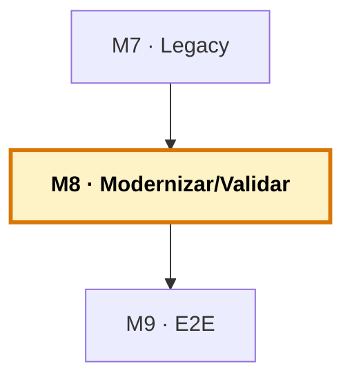

# Manual del alumno — M8 · Modernizar y validar

Esto **no** es el libro del módulo. El libro te explica por qué modernizar no es siempre reescribir, el código que compila y miente, el humano en el bucle, la red de validación y cuándo NO modernizar. Este manual va por debajo: vas a **escribir characterization tests** en los tres lenguajes, vas a **modernizar una pieza con la red puesta**, y vas a comprobar que la red es lo que de verdad importa. Es el módulo donde el legacy se transforma — con seguridad.

Tiempo de lectura: ~30 min. Lab de referencia: sección 🧪 Lab M8 del libro.

> **Ramas del repo `distribuidora` para este módulo:**
> - **Partes de:** `cap-07/docs` (sistema base + documentación del legacy)
> - **Llegas a:** `cap-08/validation` (+ tests en los tres lenguajes: `pytest`, `cobol-check`, FORTRAN)
> - **Si te pierdes:** `git checkout cap-08/validation -- python/tests fortran/test_coste_envio.f90 cobol/tests` te trae los tests canónicos.

*Creado: 2026-05-31*

---

## Dónde encaja este módulo en el curso



M8 es la pareja de M7: si M7 era entender el legacy, M8 es transformarlo — con la red de seguridad que un entorno crítico exige. Usa el equipo de agentes (M5, el verificador) y la conexión (M6). M9 cerrará con el flujo completo. Mapa completo: [`../RAMAS-DEL-REPO.md`](../RAMAS-DEL-REPO.md).

---

## 1. La idea en una frase

Antes de tocar nada, capturas el comportamiento actual del legacy en **characterization tests** —`pytest` para Python, `cobol-check` para COBOL, un driver para FORTRAN—; luego modernizas una pieza (sacar el cálculo del FORTRAN a un módulo Python, por ejemplo) y la validas ejecutando ambas versiones con los mismos datos. Si divergen en un solo caso, lo cazas en tu máquina y no en producción.

---

## 2. El problema real que hay detrás

Has usado Copilot para entender ese COBOL que nadie tocaba (M7). El siguiente paso parece obvio: «ya que lo entiende, que me lo modernice». Y sí, se puede. Pero es justo aquí donde más gente se da el golpe.

El peligro tiene nombre, y lo viste en M2: **el código que compila y miente**. Una modernización que parece correcta, que pasa una prueba rápida, y que en producción calcula el envío con un factor equivocado o pierde un caso límite que el original cubría desde hace veinte años sin que nadie lo recuerde. En un script de juguete, da igual. En el sistema que factura los envíos, es un problema serio con tu firma debajo.

Por eso este módulo cubre dos cosas, y la segunda importa más: cómo usar Copilot para modernizar, y **cómo montar la red que impide que esa modernización te explote**. Modernizar sin validar no es ir rápido: es acumular deuda que estallará más tarde y más caro.

---

## 3. Por qué esto importa en tu stack

«El código viejo es la especificación.» Por feo que sea, lleva años funcionando, y eso significa que captura reglas de negocio reales que quizá no están documentadas en ningún otro sitio: ese recargo que solo aplica a pedidos internacionales, ese redondeo heredado de una norma fiscal de hace quince años. Modernizar es, en buena parte, **descubrir esas reglas y preservarlas** — no inventarlas de nuevo.

Y hay un mensaje que rompe un prejuicio común: **en los tres lenguajes SÍ se testea**, legacy incluido. `cobol-check` (del Open Mainframe Project, funciona con GnuCOBOL, tiene extensión de VS Code) da el mismo nivel de granularidad que pytest o JUnit. No hay excusa de «en mi lenguaje no se puede».

---

## 4. Cómo funciona por dentro: la red, capa a capa

- **Caracteriza antes de tocar.** Captura el comportamiento actual: entradas conocidas y sus salidas reales del programa viejo. Son las characterization tests — no prueban que el código sea «correcto», prueban que la versión nueva hace **lo mismo** que la vieja. Para legacy sin pruebas, este es el primer paso irrenunciable.
- **Compara las dos versiones con los mismos datos.** Pasa el mismo lote por el viejo y por el nuevo, salida a salida. Si divergen en un caso, hay algo que entender antes de seguir.
- **Prueba los bordes, no solo el caso feliz.** El cero, el negativo, el valor enorme, el pedido sin líneas. En el coste de envío, los pesos exactos de 5, 15 y 30 kg (los límites de tramo).
- **Revisa lo que el modelo sabe peor.** Una modernización de Python la revisas rápido; una de COBOL, con lupa.

---

## 5. Recorrido guiado: caracterizar y modernizar

### 5.1. Ponte en el estado de M8

```bash
git checkout cap-08/validation
code .
```

### 5.2. Ejecuta los tests de Python

```bash
cd python
pip install pytest      # si no lo tienes
pytest
```

Los tests caracterizan el parte de pedidos: el total de ventas (955,50 €), las ventas por categoría (HW 265, EL 476,50, PL 214), y casos límite como el redondeo bancario de Python (`0.125` → `0.12`, no `0.13`). Ese caso del redondeo es el típico que «compila y miente»: una versión modernizada en otro lenguaje que redondee «half up» daría `0.13` y divergiría aquí.

### 5.3. Ejecuta los tests de FORTRAN

```bash
cd ../fortran
gfortran -o test_coste_envio envio_mod.f90 test_coste_envio.f90
./test_coste_envio
```

Verás los tests de los tramos y, sobre todo, los **bordes exactos**: 5,0 kg → 12,50 € (tramo 0-5), 15,0 kg → 27,00 € (tramo 5-15), 30,0 kg → 42,00 € (tramo 15-30). Esos bordes son justo donde una modernización descuidada se equivoca de tramo.

> Fíjate en que el test usa el módulo `envio` (de `envio_mod.f90`). Que las funciones estén en un módulo, y no dentro del `program`, es lo que las hace testeables. **«Hacer el código testeable» es el primer paso de caracterizar legacy** — no puedes probar una función encerrada en un `program` interactivo.

### 5.4. Mira los tests de COBOL

Abre `cobol/tests/inventario-tests.cut`. Son tests de `cobol-check`: casos escritos en un DSL parecido al propio COBOL, que mockean el fichero y verifican la búsqueda y la regla de la categoría (2 primeras letras del código). Para ejecutarlos necesitas `cobol-check` instalado; el patrón es lo que importa.

### 5.5. Moderniza con red

Ahora la pieza fuerte. Pide al equipo de agentes (o hazlo a mano con el chat) modernizar el cálculo del coste de envío: sacarlo del FORTRAN a un módulo Python equivalente. El flujo:

1. **Entender** (M7) — ya tienes la documentación del FORTRAN.
2. **Caracterizar** — los tests del FORTRAN son tu vara de medir.
3. **Proponer** — pide el módulo Python equivalente. Python es donde Copilot va sobrado.
4. **Validar contra el original** — ejecuta ambos con los mismos pedidos y compara. ¿Coinciden todas las salidas, incluidos los bordes de 5, 15 y 30 kg?

Busca a propósito un caso límite donde puedan diferir. Si encuentras uno, has visto por qué la red importa.

### 5.6. Cierra con trazabilidad (opcional)

Con el equipo y el MCP de M6: issue que describe la modernización, PR con el módulo nuevo y sus tests, enlazado al issue.

---

## 6. Cuándo NO modernizar

Un módulo honesto sobre modernización tiene que decirlo: **a veces la respuesta correcta es no tocar.**

- **Funciona, es estable y nadie lo toca.** Si ese FORTRAN lleva veinte años dando el número bueno, modernizarlo es asumir riesgo a cambio de nada.
- **No entiendes del todo lo que hace.** Modernizar lo que no comprendes es la receta del desastre. Primero entiéndelo (M7); si no llegas, no lo reescribas.
- **El coste de un error es altísimo y la ganancia, pequeña.** Si un fallo costaría una fortuna y modernizar ahorra poco, la cuenta no sale.

Modernizar es un medio para mejorar la mantenibilidad, no un fin. La pregunta no es «¿puede Copilot modernizar esto?» —casi siempre puede intentarlo— sino **«¿debería, y compensa el riesgo?»**. Esa decisión es tuya.

---

## 7. Errores comunes

- **Modernizar sin caracterizar primero.** Sin la vara de medir, no sabes si la versión nueva cambió algo. Caracteriza antes de tocar.
- **Probar solo el caso feliz.** Los bordes (cero, negativo, límites de tramo) son donde la modernización se rompe. Cúbrelos.
- **Confiar en que «compila luego funciona».** El error que compila y miente es el más caro. Compara contra el original.
- **Modernizar lo que funciona y nadie toca.** Riesgo sin ganancia.

---

## 8. Verificación: ¿está bien cerrado el módulo?

1. **`pytest` pasa** en `python/` — el parte de pedidos está caracterizado.
2. **El test driver de FORTRAN pasa** — los tramos y bordes están cubiertos.
3. **Has revisado los tests de `cobol-check`** y entiendes el patrón.
4. **Has modernizado una pieza** (o seguido el flujo) y la has **validado contra el original** con los mismos datos.
5. **Tienes claro** cuándo NO modernizar.

Si los cinco están, has cerrado M8.

---

## 9. Qué te llevas a M9

- **La red de validación** en los tres lenguajes: characterization tests que congelan el comportamiento.
- **El reflejo de caracterizar antes de transformar**, y de comparar contra el original.
- **El criterio de cuándo no tocar.**

Lo siguiente, en M9: todo junto. Vas a coger una mejora real y verla recorrer el flujo completo —issue → plan → implementación → verificación → PR— con el equipo de agentes coordinado, sobre el proyecto de tres lenguajes. El cierre del curso: de usar Copilot a gobernarlo.

---

> **Nota.** Para el contenido base completo (modernizar no es reescribir, el código que compila y miente, el humano en el bucle, la red capa a capa, cuándo NO modernizar), abre el libro firmado en [`../../temario/DEVCOP-M8-modernizar-validar.md`](../../temario/DEVCOP-M8-modernizar-validar.md).
