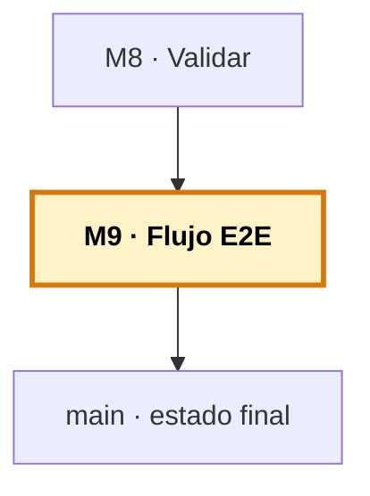

# Manual del alumno — M9 · Flujo E2E: todo junto

Esto **no** es el libro del módulo. El libro te explica qué es un flujo E2E, cómo se integran las cinco piezas, quién dirige y la diferencia entre usar y gobernar Copilot. Este manual va por debajo: vas a **ejecutar el flujo entero una vez** —de un issue a un PR— con el equipo de agentes coordinado, sobre el proyecto de tres lenguajes. Es el cierre del curso: todas las piezas funcionando como un sistema.

Tiempo de lectura: ~25 min. Lab de referencia: sección 🧪 Lab M9 del libro.

> **Ramas del repo `distribuidora` para este módulo:**
> - **Partes de:** `cap-08/validation` (sistema base + tests)
> - **Llegas a:** `cap-09/complete` (+ la mejora producida por el equipo: importe medio por categoría, con su test)
> - **Si te pierdes:** `git checkout cap-09/complete` te deja el estado final del curso.
> - **Ojo a las dos clases de rama:** la mejora se hace en una rama de **trabajo** (`feature/media-por-categoria`); `cap-09/complete` es la rama de **estado del curso** donde queda guardado el resultado.

*Creado: 2026-05-31*

---

## Dónde encaja este módulo en el curso



M9 cierra el curso. No añade capas nuevas al sistema: **lo usa entero**. Las cinco piezas (instructions, skills, agents, MCP, validación) operan juntas en un flujo issue→PR sobre el caso de tres lenguajes. Mapa completo: [`../RAMAS-DEL-REPO.md`](../RAMAS-DEL-REPO.md).

---

## 1. La idea en una frase

Coges una mejora real —«añadir el importe medio por categoría al informe de pedidos»—, se la das al orquestador, y ves cómo el equipo la lleva de principio a fin: el analista planifica, tú apruebas el plan (Plan Mode), el desarrollador implementa, el verificador comprueba, y el orquestador abre el PR enlazado al issue — **todo sin salir del editor**, con tu visto bueno en cada paso.

---

## 2. El problema real que hay detrás

Un flujo E2E es recorrer todo el ciclo de una tarea sin cambiar de herramienta: desde que algo entra como incidencia hasta que sale como pull request listo para revisar.

En un flujo tradicional, tú eres el pegamento entre herramientas: lees el issue en el navegador, copias lo que importa, vuelves al editor, escribes, abres una terminal para probar, vuelves al navegador para el PR. Cada salto cuesta tiempo y rompe la concentración. Con las piezas del curso montadas, **ese pegamento lo pone Copilot, mientras tú diriges**.

Durante ocho módulos montaste las piezas: instructions (las convenciones por lenguaje), skills (el conocimiento, incluido el de tu COBOL y FORTRAN), agents con handoffs reales (los roles y el orquestador), MCP (la conexión con GitHub). Cada una resuelve su parte. Pero tenerlas sueltas es como tener los músicos sin orquesta: cada uno sabe tocar, falta que toquen juntos. M9 es la integración.

---

## 3. Por qué esto importa en tu stack

El flujo es el mismo para los tres lenguajes, pero la red aprieta donde el lenguaje es más difícil. Si la mejora toca el COBOL o el FORTRAN, el papel del verificador pesa aún más: es el que ejecuta con datos conocidos y caza el error que el modelo, sabiendo menos de esos lenguajes, podría colar sin que se note. En Python, revisión ágil; en legacy, la red de seguridad del equipo es lo que más vale.

---

## 4. Cómo funciona por dentro: cada pieza en su momento

| Momento del flujo | Pieza que actúa |
| --- | --- |
| El analista conoce el proyecto | Instructions (M3) |
| El analista carga el saber del dominio | Skills (M4) |
| Los roles se coordinan | Agents + handoffs (M5) |
| Apruebas antes de ejecutar | Plan Mode (M5) |
| Issue y PR desde el chat | MCP / gh (M6) |
| Entender el legacy antes de tocar | M7 |
| Validar lo que se transforma | M8 |

No usas una pieza u otra: trabajan juntas, cada una en su momento. Eso es lo que convierte ocho módulos sueltos en un flujo.

---

## 5. Recorrido guiado: el flujo completo

### 5.1. Ponte en el estado de partida

```bash
git checkout cap-08/validation
code .
```

Parte del proyecto con todo montado (instructions, skills, agentes, MCP/`gh`, tests). El `pedidos.py` de aquí **todavía no tiene** el importe medio por categoría — esa es la mejora que el equipo va a añadir.

### 5.2. El issue

Habla con el orquestador:

```
El informe de pedidos debería incluir el importe medio por categoría de
producto. Crea un issue para esta mejora.
```

El orquestador crea el issue en GitHub (por MCP; si no autentica, cae al `gh` CLI). Ya tienes el número de seguimiento.

### 5.3. El plan (y Plan Mode)

El orquestador llama al analista, que conoce el proyecto por las instructions y carga el skill `order-data`. Propone un plan: añadir la agregación por categoría a `calcular_estadisticas`, con su prueba.

**Aquí entra tu control:** con Plan Mode, lee el plan y apruébalo antes de que nadie toque código. Si algo no encaja, corrígelo.

### 5.4. Implementación y verificación

Con el plan aprobado, el desarrollador implementa la agregación siguiendo las convenciones (instructions) y el formato del parte (skill). Genera el código y lo prueba.

El verificador ejecuta el script con un parte de pedidos conocido y comprueba que el importe medio sale bien; contrasta contra los criterios del plan. Si algo no cuadra, da REVISAR y el orquestador devuelve el trabajo al desarrollador — con el tope de vueltas de M5.

### 5.5. El cierre: el PR

Con el visto bueno del verificador, el orquestador abre el PR en GitHub con título, descripción y resumen — incluyendo `closes #N` en la **descripción del PR** (no en el commit), para que al fusionar se cierre el issue automáticamente.

Comprueba en GitHub que el issue y el PR existen y están enlazados. **Todo el recorrido ha ocurrido sin salir del editor.**

### 5.6. Compara con la rama de referencia

```bash
git diff cap-08/validation cap-09/complete -- python/
```

Verás exactamente lo que el flujo produjo: la media añadida a `calcular_estadisticas`, mostrada en `main`, y sus tests nuevos. Ese diff es el resultado del equipo trabajando.

> **Recuerda las dos clases de rama:** la mejora se hace en una rama de trabajo `feature/media-por-categoria` que acaba en PR (contenido del curso). `cap-09/complete` es donde guardamos el resultado como checkpoint del curso (andamiaje). No las confundas.

---

## 6. Quién dirige

Cuando el orquestador «coordina», no decide solo. **Tú diriges:** apruebas el plan (Plan Mode), revisas en cada handoff, das el visto bueno al PR. Copilot ejecuta cada paso; las decisiones y los puntos de control son tuyos.

Un sistema que hiciera todo solo, sin puntos de control, sería rápido pero peligroso: un error se propagaría hasta el PR sin que nadie lo viera. Con control humano en cada paso, mantienes la velocidad sin perder el criterio.

---

## 7. De usar a gobernar Copilot

Hay una diferencia de fondo entre cómo empezaste el curso y dónde estás ahora. **Usar Copilot** es pedirle cosas y aceptar lo que devuelve — funciona en lo común, falla en lo tuyo. **Gobernar Copilot** es lo que has aprendido:

- Enseñarle tus convenciones → instructions
- Empaquetar tu conocimiento → skills
- Darle roles con límites → agents
- Conectarlo con tus herramientas → MCP
- Dirigir cada paso del flujo → Plan Mode, validación

La diferencia no es de herramienta — es de quién manda. **El que gobierna no es la IA: eres tú.**

---

## 8. Errores comunes

- **El issue vago.** «Mejora el rendimiento» no es una tarea, es un deseo. Issue difuso → plan difuso → todo se resiente.
- **Aprobar sin leer.** El riesgo del flujo cómodo. Un plan malo aprobado se vuelve código malo.
- **Confiar más donde el modelo sabe menos.** Ir tan rápido en COBOL como en Python. Es justo al revés.
- **Desconectar del todo.** El flujo no te sustituye: te ayuda a ir más lejos. Si apruebas a ciegas, los errores llegan al PR. Eres el director, no un espectador.

---

## 9. Verificación: ¿está bien cerrado el módulo (y el curso)?

1. **Has ejecutado el flujo entero** una vez: issue → plan → implementación → verificación → PR.
2. **Has aprobado el plan con Plan Mode** antes de que el equipo implementara.
3. **El issue y el PR existen en GitHub y están enlazados** (`closes #N` en la descripción del PR).
4. **El `git diff cap-08…cap-09`** muestra la mejora que produjo el equipo.
5. **Tienes claro** que tú diriges y el equipo ejecuta — la diferencia entre usar y gobernar.

Si los cinco están, has cerrado M9 y el curso.

---

## 10. Lo que te llevas

Si tuvieras que quedarte con una sola idea:

> **Copilot rinde distinto según lo que sabe, y tu trabajo es leer ese mapa.**

Con Python, vuela — tú vigilas. Con COBOL y FORTRAN, sabe menos: le das el contexto que le falta (instructions, skills), lo usas para entender antes que para escribir (M7), y validas con red lo que transforma (M8). Esa habilidad —dar contexto, desconfiar con criterio, validar donde importa— no se queda anticuada cuando cambie el modelo o salga el próximo lenguaje raro que te toque mantener.

---

> **Nota.** Para el contenido base completo (las cinco piezas integradas, quién dirige, de usar a gobernar), abre el libro firmado en [`../../temario/DEVCOP-M9-flujo-e2e.md`](../../temario/DEVCOP-M9-flujo-e2e.md).
